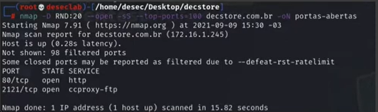
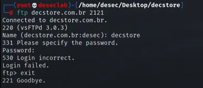

---
>Titulo: Dia 1.1 - Mapeando o Host
>Fase: Recon
>Dia: 1
---

### Aqui iremos começar a mapear as portas abertas do nosso host, nesse caso já temos o escopo "WEB" definido.

### Vamos iniciar registrando todos os Scripts que serão usados nesse processo
---

### Preparar o ambiente
```bash
cd /home/kali/Desktop        #Mova para um diretório de sua escolha
mkdir Desec                  #Crie uma pasta somente para o Pentest
cd /home/kali/Desktop/Desec  #Mova para o diretório do Pentest
```
---

### Registrar comados

>No Shell Root, isso irá registrar o histórico dos comandos que executar.
  **Scripts:** D1-Mapeando
---

### Mapear portas abertas utilizando o [[../../0-assets/tools/Nmap]]
```bash
# Em sistema protegido, com menos ruídos
nmap -D RND:20 --open -sS --top-ports=100 <TARGET> -oN Portas-abertas

# Em sistema sem proteção, bem mais rápido mas com muito ruídos
nmap --open -sS -p- --min-rate=60000 <TARGET> 

# Print a saída das portas abertas para documentação
```
---

### Identificar serviços escutando na porta
```bash
nmap --open -sV -p80,443,8080 <TARGET> -oN Portas-versao

# Print a saída da versão das portas abertas para documentação

```
---
{ 

Portas 80, 2121
}



---
#nmap
#scan #Mapping 
