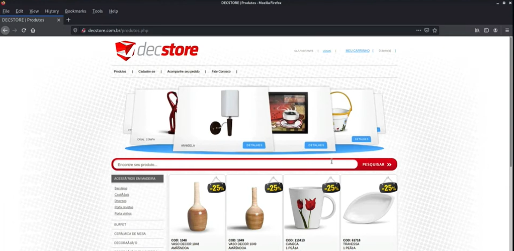
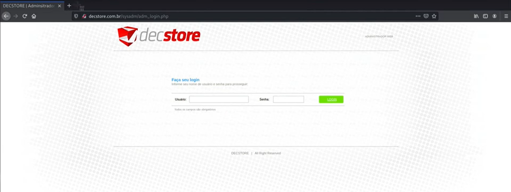
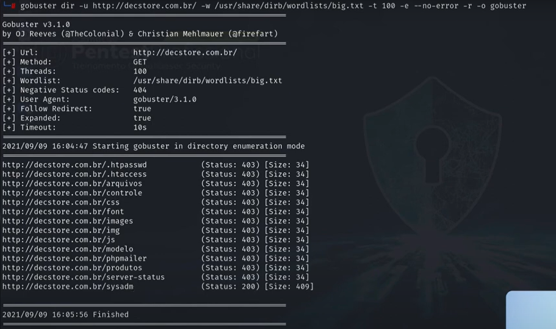

---
>Titulo: Dia 1.2 - Interfaces administrativas
>Fase: Recon
>Dia: 1
---

Vamos testar a porta 2121, para tentar conectar ao FTP.
```bash
ftp decstore.com.br 2121
```
>Aqui irá pedir uma senha, nós não sabemos a senha, 
>Mas agora sabemos que é possível interagir com esse serviço, ou seja, 
>O [[../../0-assets/protocols/FTP]] está exposto para a rede.




---

Agora vamos abrir o endereço do host no navegador.


Não temos acesso administrativo, na verdade, nenhum acesso, apenas conseguimos ver a interface do host.

---

Vamos testar com o [[../../0-assets/tools/Gobuster]] se conseguimos fazer um teste de força bruta nesse host.

```bash
gobuster dir -u http://desctore.com.br/ -w /usr/share/dirb/wordlists/big.txt -t 100  -e --no-error -r -o gobuster
```
>Agora, cada detalhe desse comando
>Gobuster   | Ferramenta usada no bruteforce
>dir -u         | URL alvo
>-w              | Wordlist no diretório do atacante
>-t 100        | Até 100 threads simultâneas(scan mias rápido)
>-e               | Mostrar a URL completa do que encontrou
>--no-error | Não retornar nenhum erro
>-r                | Se a página redirecionar, seguir o redirecionamento
>-o               | Salvar essa saída como "Gobuster"



Vamos testar o resultado desse código "200" no navegador
>Conseguimos ver a interface administrativa da Decstore
   Em http:decstore.com.br/sysadmin
   


---

 #Gobuster 
 #FTP #Dir #Mapping