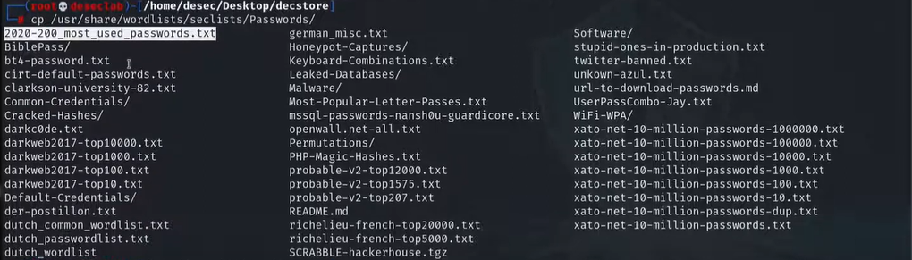
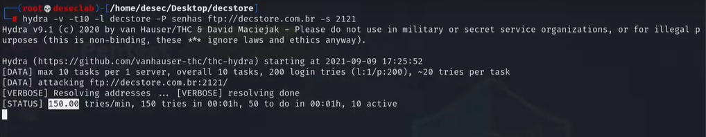

---
>Titulo: Dia 1.3 - Testando força bruta FTP
>Fase: Brute-force FTP
>Dia: 1

#Hydra
#FTP #BruteForce #SecLists 

---

O Kali Linux por padrão vem com muitas ferramentas e até algumas wordlists que podem ser usadas em brute-forces.
Pode verificar nos seus diretórios se já tem alguma que possa ser usada nesse teste ou baixar algumas das seguintes formas.

Pesquisar no Github, ou baixar diretamente dos diretórios apt
```
sudo apt install seclists
```

Aqui dentro de Seclists tem muitas senhas, exemplo:



>Nosso objetivo aqui será usar uma seclist pequena, pois só quermos testar se o sistema tem algum tipo de proteção contra brute-force, se seremos bloqueados com essas tentativas, ou se podemos prosseguir com testes, mais completos com diversas possibilidades de senhas.
>Assim validando se já há uma vulnerabilidade.


Para testar o FTP iremos usar o [[../../0-assets/tools/Hydra]]
```bash
hydra -v -t10 -l decstore -P senhas ftp://decstore.com.br -s 2121
```
>Hydra    | Ferramenta
>-v           | Verbose(exibir os testes na tela)
>-t10       | Usar 10 threads simultâneas(testes mais rápidos)
>-l            | Usuário ou wordlist
>-P           | Wordlist com senhas
>ftp://      | Estamos indicando o tipo de acesso que estamos testando
>-s           | Indicamos a porta, pois neste caso não será a padrão 21, e sim 2121.


Por esse tipo de resposta, conseguimos ver que o Hydra estava realizando 150 tentativas por minuto, já podemos saber que há uma vulnerabilidade aqui, pois mesmo que não tenhamos quebrado a senha ainda, sabemos que o sistema não impõe nenhum tipo de limite de tentativas.
Caso houvesse, os testes teriam sido interrompidos com a mensagem de "timeout".
>Assim validando, esse sistema é vulnerável a um ataque de força bruta.

---
