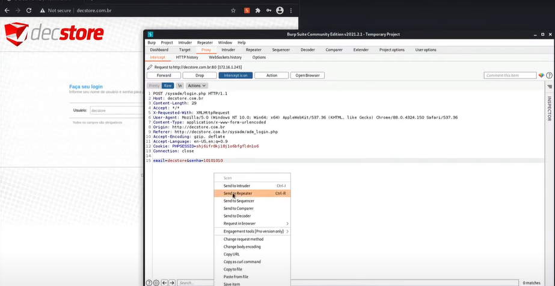
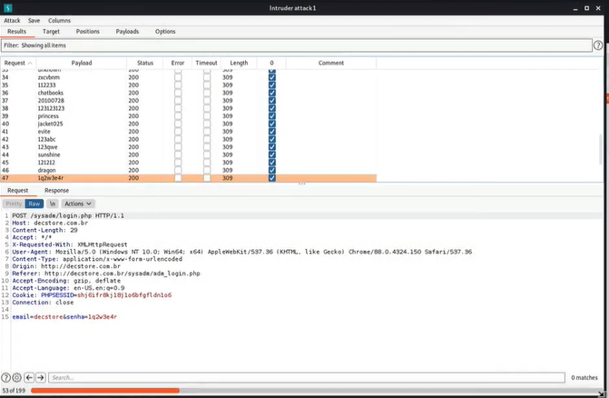

---
>Titulo: Dia 1.4 - Testando força bruta WEB
>Fase: Brute-force WEB
>Dia: 1
---

Primeiro uso do [[../../0-assets/tools/Burp Suite]] 
Iremos utilizar um proxy, e nesse caso será o Burp Suite para validar a aplicação.
Iremos testar o painel administrativo.

---

Vamos iniciar o Burp, selecionar a opção de proxy e "opne browser"e irá abrir o próprio browser do Burp.

>Iremos inserir o endereço do nosso host e no Burp deixar ele no modo proxy > intercept, e já irá iniciar a interceptar o trafego da requisição.

Poderiamos fazer várias tentativas de requisição de forma manual na interface de login, mas vamos fazer esse processo de forma mais divertida, pelo proxy.

Vamos tentar fazer um login na plataforma, apenas para ver a resposta do host, vamos pegar a linha de resposta do login e enviar para o Intruder.

>Dentro do Intruder dá para configurar os testes de força bruta, mas vou deixar para documentar isso em uma outra oportunidade

---

O sistema não bloqueou após 3-5 tentativas inválidas, logo, o painel administrativo é vulnerável a ataque de força bruta. Logo após 47  tentativas, ele continuou disponível para novos testes de senhas e usuários.

---

# Ainda não entendi o suficiente para documentar de forma que seja mais legível que visual por imagens...

---

#BurpSuite #Burp 
#Intercepter #Intruder
