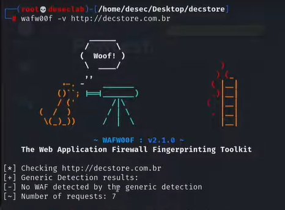
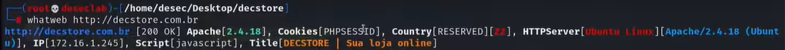
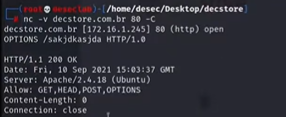

---
>Titulo: Dia 2.1 - Mapeando a aplicação web
>Fase: Mapping
>Dia: 2
---

Nosso foco aqui será tentar identificar algum tipo de [[../../0-assets/tools/WAF]](Web Application Firewall).

---

Iremos utilizar inicialmente uma ferramenta chamada [[../../0-assets/tools/wafw00f]] para verificar se há algum tipo de WAF, ele irá enviar uma série de requisições que por meio das respostas que ele devolver, iremos descobrir o tipo de Web Firewall esta aplicação possa estar utilizando.

Vamos começar com o comando:
```bash
wafw00f -l
```
Onde irá listar uma sequencia de firewalls listados, onde você conseguirá analisar eles por meio da resposta da requisição.

Nosso primeiro teste será o seguinte:
```bash
wafw00f -v http://decstore.com.br
```
>Como de costume o "-v" é de verbose, te permite ler o que está acontecendo com o código, quantos mais "-vvv", isso irá melhorar sua visualização das checagens sendo realizadas pelo wafw00f.

que irá retornar:

"No WAF detected by the generic detection"
>Onde podemos ver uma boa notícia,  provavelmente, não terá nada filtrando o trafego das requisições web, onde abre portas para ataques de [[../../0-assets/vulnerabilities/SQL Injection]] & [[../../0-assets/vulnerabilities/XSS]].

---

## Agora nós queremos identificar a tecnologia em uso
Para isso iremos utilizar a ferramenta [[../../0-assets/tools/Whatweb]] da seguinte forma:
```bahs
whatweb http://decstore.com.br
```

E então ele trará uma seguinte análise:


A partir dessas informações, conseguimos ver algumas coisas interessantes:

```bash
URL                  | http://decstore.com.br
Status HTTP          | 200 OK
Servidor Web         | Apache 2.4.18
Cookie               | PHPSESSID
Country              | RESERVED (ZZ)
Sistema Operacional  | Ubuntu Linux
IP                   | 172.16.1.245
Scripts              | JavaScript
Title                | DECSTORE | Sua loja online

```

---

## Podemos também verificar por métodos aceitos
Para isso iremos utilizar a ferramenta [[../../0-assets/tools/Netcat]] da seguinte forma:
```bash 
nc -V http://decstore.com.br 80 -C 
	OPTIONS /randomicamentealeatorio HTTP/1.0
```

Onde irá retornar com os seguintes métodos:


GET, HEAD, POST, OPTIONS

---
#wafw00f #Whatweb #Netcat
#WAF #Firewall 