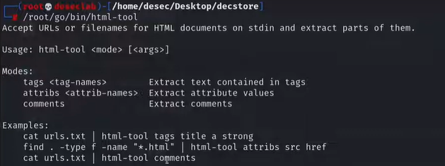
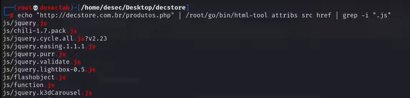
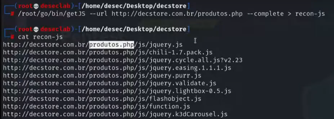
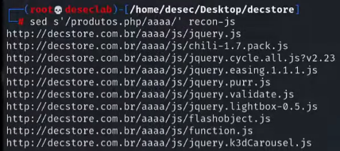

---
>Titulo: Dia 2.2 - Identificando Entry Points
>Fase: Mapping
>Dia: 2
---

Vamos automatizar uma tarefa para ler o código fonte das nossas páginas, com o intuito de encontrar comentários, links, JS, possíveis scripts, analisar possíveis Entry Points.

---

### Preparação
Instalar o [[HTML-Tool]]
Comandos para instalação do html-tool no Kali:
```bash
apt install golang

## Método 1
git clone https://github.com/tomnomnom/hacks.git
cd hacks/html-tool
go build -o html-tool

## Preciso validar se funcionar
go get -u github.com/tomnomnom/hacks.git

# Outra ferramenta específica para JS
go get github.com/003random/getJS
```

Agora com este comando poderemos ver as possibilidades de uso desta ferramenta:


---

Para usar ela, podemos simplesmente fazer assim:

```bash
echo "http://decstore.com.br/produtos.php" | /root/go/bin/html-tool <ARGS>
```

Podemos testar os seguintes argumentos:
>COMMENTS
>TAGS TITLE
>TAGS SCRIPT
>ATTRIBS SRC
>ATTRIBS SRC HREF

Para identificar arquivos em JS, poderiamos fazer dessa forma
```bash
echo "http://decstore.com.br/produtos.php" | /root/go/bin/html-tool attribs src href | grep -i ".js"
```

Onde ele responderia:


E isso é interessante pois as vezes o desenvolvedor pode deixar arquivos JS que pode conter informações que pode nos permitir descobrir APIs, URLs, endpoints, outros endereços dentro da aplicação que a gente consiga manipular.

Da mesma forma que fizemos com ".js", podemos fazer com ".php"

---
### Usando o getSJ
```bash
/root/go/bin/getJS --url http://decstore.com.br/produtos.php --complete
```

E a resposta irá sair assim:


> Perceba que usando essa ferramenta, veio com a url modificada, logo, quebrada...
> Mas conseguimos ajustar isso, removendo o "/produtos.php/", faremos da seguinte forma:

Utilizando o comando:
```bash
## Garantir que estamos no diretório onde o arquivo foi salvo
cd /home/user/Desktop/desec

## Use o comando:
sed s'/\/produtos.php//' recon-js
```



---


#HTML-tool #getJS 
#Tomnomnom

