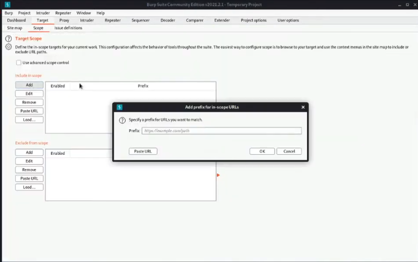
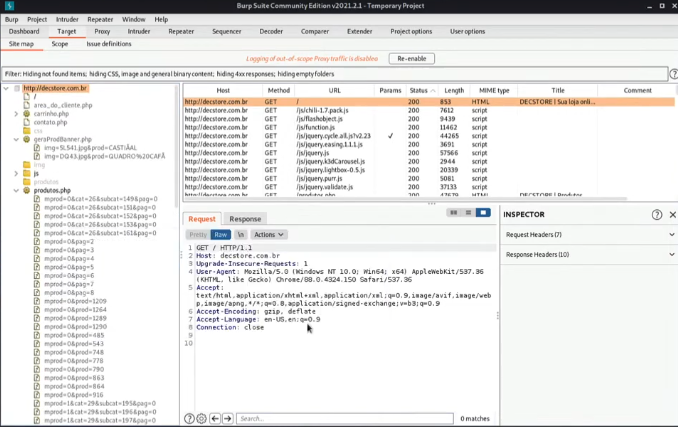

---
>Titulo: Dia 2.3 - Realizando Spidering na Aplicação
>Fase: Spidering
>Dia: 2
---

Aqui nós iremos utilizar o BurpSuite para realizar o Spidering.
Vamos iniciar o Burp, ir em Target > Scope e adicionar o sicopo do nosso teste.

Onde iremos utilizar nosso escopo "http://decstore.com.br"

Essa será nossa visibilidade da estrutura no Scope.
E conforme você vai navegando pelo site, o Burp vai mapeandro a estrutura do seu escopo.

## De fato aqui eu percebi 1% do poder do BurpSuite.
#### Novamente, não consegui absorver totalmente o que poderia documentar aqui. Mas foi de extrema valia para perceber que o BurpSuite é sim uma ferramenta incrível e que merece um foco totalmente destinado para ele até o domínio pleno.

---
#BurpSuite 
#Spidering #Mapping