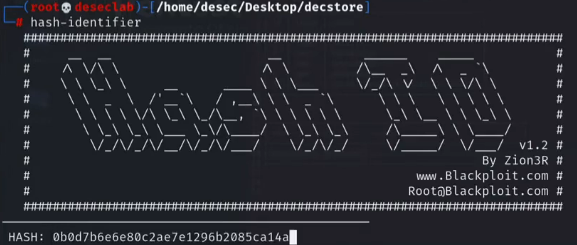
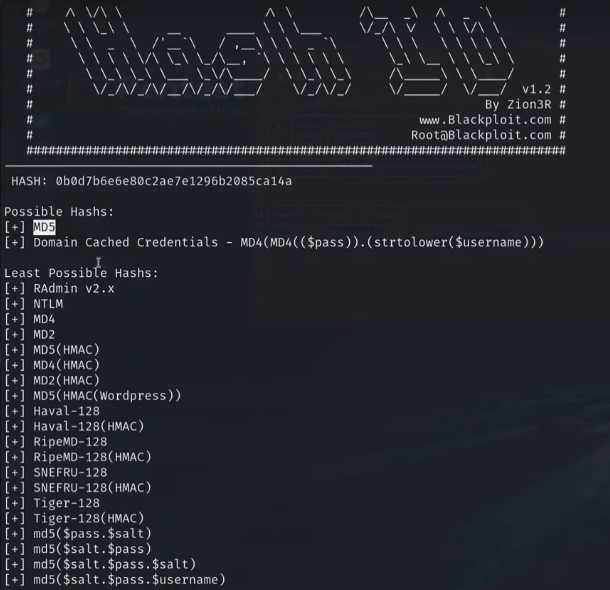
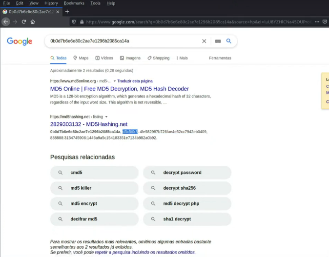
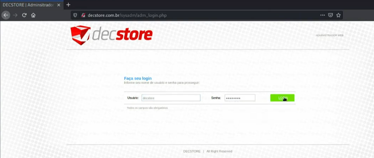
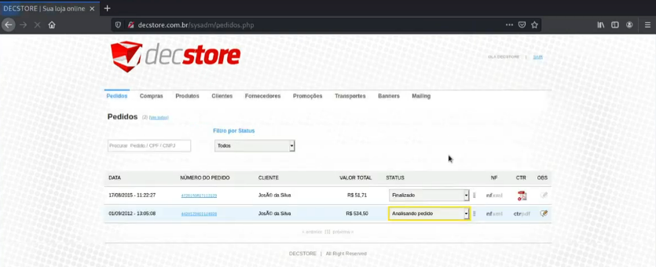
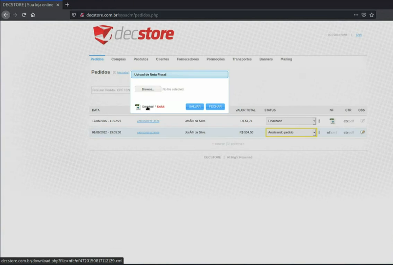
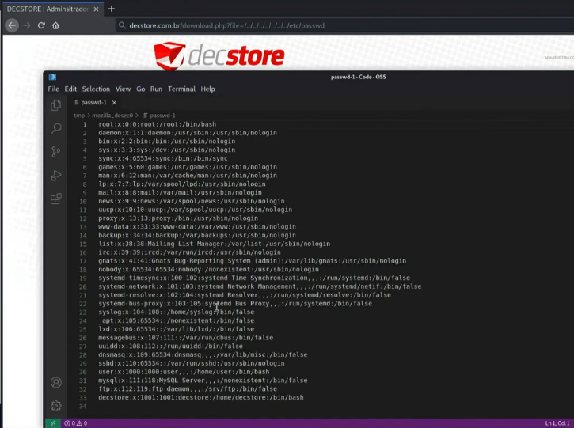

---
>Titulo: Dia 3.3 - Pós exploração SQLi | parte 1/2
>
>Fase: post-exploration
>
>Dia: 3

[LFI](../../0-assets/vulnerabilities/LFI.md)

[SQLmap](../../0-assets/tools/SQLmap.md) | [HachsCat](../../0-assets/tools/HashCat.md) | [JohnTheRipper](../../0-assets/tools/JohnTheRipper.md) | [Hash-indetifier](../../0-assets/tools/Hash-identifier.md)  

[SQL Injection](../../0-assets/vulnerabilities/SQL%20Injection.md) 

#LFI #Blind-SQLI 

---

Nosso objetivo agora é descobrir a senha do banco de dados atual, o "deckstore".
Para isso temos como parâmetro as senhas do banco de dados antigo, e podemos usar algumas ferramentas para tentar quebrar o hash da senha do usuário DeckStore.
Ferramentas como:
```python
HashCat | JohnTheRipper | & sites online
```

Vamos primeiro usar a ferramenta [Hash-indetifier](../../0-assets/tools/Hash-identifier.md) para identificar o  tipo de hash que ele é
```python
hash-identifier
```



Onde iremos inserir nosso hash e iremos receber a seguinte resposta.


Agora sabemos que possívelmente, esse hash seja um MD5.
Então iremos agora, jogar esse hash em sites que tem bancos de dados de senhas gigantes, que podem poupar o nosso serviço de rodar ferramentas.

Onde com uma pesquisa simples no Google, já localizar a possível senha...


Vimos que saiu algo que pode realmente ser a senha que procuramos, vamos validar se o hash bate com o que nós temos:

```python
## Nosso hash que coletamos com o dump da base de dados é este:
0b0d7b6e6e80c2ae7e1296b085ca14a

## Vamos usar um script simples no terminal para criptografar nosso texto em MD5:
echo -n "d3c5t0r3" | md5sum
> 0b0d7b6e6e80c2ae7e1296b085ca14a
### Vimos então que realmente, esta senha bate exatamente nosso hash.
```

Agora que sabemos que temos a senha, vamos tentar realizar login no painel sysadmin da 
http://decstore.com.br/sysadm



E realmente, conseguimos o acesso:



Agora de fato, estamos dentro do painel administrativo da plataforma.
Temos total acesso a todas as informações de Pedidos, Compras, Produtos, Clientes e Fornecedores, etc...

---

No [Dia 2.5](../2-mapeando-aplicacao/2.5-disclosure.md), nós descobrimos depois de alguns testes, a vulnerabilidade LFD, onde testamos a URL ``http://decstore.com.br/download.php?file=``
Agora dentro do painel admin, conseguimos ver onde esse Entry Point aparece



Que seria no campo de download de mídias, como NF e Contratos.
>Passando o mouse em cima da opção de "download", conseguimos ver a URL sendo exibida no canto inferior esquerdo.

E assim, agora podemos validar que esse tipo de acesso, SOMENTE deveria ser possível, para quem tivesse acesso administrador, mas nós conseguimos visualizar mesmo sem nenhum tipo acesso.
Apenas como visitante, conseguimos um acesso que permite download de mídias desse nível, como NF e contratos de clientes e fornecedores.

Para validar que essas informações podem ser obtidas sem acesso privilegiado, abra uma guia anonima e cole a URL, e verá que também é possível visualizar da mesma forma.

Agora sabendo disso, vamos subir o nível e testar um outro tipo de vulnerabilidade nessa mesma URL de download.

---
### Testando uma vulnerabilidade de LFI (Local File Inclusion)

LFI é uma vulnerabilidade que ocorre quando uma aplicação web permite que o usuário **informe arquivos do sistema** através de parâmetros da URL, **sem validação adequada**.  
Isso pode permitir o acesso a arquivos internos do servidor.

Em termos simples:  
o site acaba deixando você “escolher” qual arquivo do servidor ele vai tentar abrir.

---

### Como o teste funciona

O teste consiste em **manipular parâmetros da URL** para tentar acessar diretórios e arquivos sensíveis do sistema operacional do servidor.

Exemplo:

```python
http://decstore.com.br/download.php?file=/../../../../../etc/passwd
```

Nesse caso:

O parâmetro `file` provavelmente é usado pelo servidor para carregar um arquivo
    
 Os `../` servem para **voltar diretórios** na árvore do sistema
    
 O objetivo é alcançar arquivos fora da pasta esperada pela aplicação

---

#### Por que `/etc/passwd`?

O arquivo `/etc/passwd` é um arquivo padrão em sistemas Linux que contém:

- Lista de usuários do sistema
    
- Informações básicas sobre cada conta
    

Ele **não contém senhas**, mas é extremamente útil para:

- Confirmar que o servidor é Linux
    
- Enumerar usuários válidos
    
- Avançar em outras etapas de exploração
   

---

### Contexto do alvo

Sabemos que o servidor utiliza **Ubuntu**, informação confirmada anteriormente na etapa  
[`2.1-mapping-web`](../2-mapeando-aplicacao/2.1-mapping-web.md).

Por isso, faz sentido tentar acessar arquivos padrão de sistemas Linux, como:

- `/etc/passwd`
    
- `/etc/hosts`
    
- `/proc/version`

Onde a resposta será:


Assim confirmando mais uma vulnerabilidade, uma LFI.
Que pode nos permitir navegar livremente pelo servidor Ubuntu com um usuário sem permissões, mas podemos escalar privilégios, onde a plataforma da DecStore está hospedado.

---
