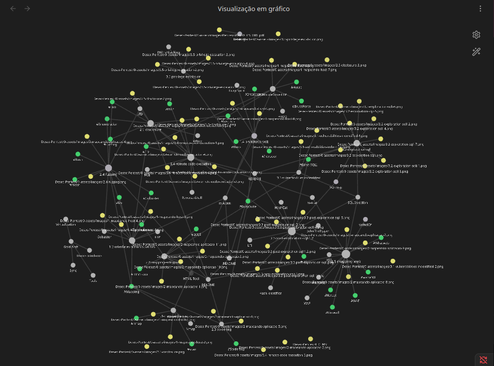

# Desec - Introdução ao Pentest 
## (Documentação teórica)

---

## Visão Geral

Este repositório documenta, de forma teórica e técnica, o desenvolvimento do curso: 
**Desec – Introdução ao Pentest**.

O foco é registrar:
- Metodologia aplicada
- Ferramentas utilizadas
- Vulnerabilidades identificadas
- Evidências técnicas (PoC)
- Processo de exploração até o acesso administrativo

Todo o conteúdo foi produzido com fins **educacionais**, em ambiente controlado.

---

	Link do curso gratuito da Desec no YouTube

[https://www.youtube.com/watch?v=Nz770bwORec&list=PLgPnpEa6XZFqPxSvzNU8WsuLzlaqnv3Ot]()

---

	Link do curso gratuito da Desec na Plataforma

https://desecsecurity.com/curso/introducao-pentest

---

# Sumário 

## Dia 1 - Mapeamento de Host
➡️ [Ver documentação técnica](1-poc/1-mapeando-host/README.md)

## Dia 2 - Mapeamento da Aplicação
➡️ [Ver documentação técnica](1-poc/2-mapeando-aplicacao/README.md)

## Dia 3 - Pós-Exploração
➡️ [Ver documentação técnica](1-poc/3-post-exploration/README.md)

---

## Registro de Vulnerabilidades
>
 >**Dia 1.3** - FTP vulnerável a Brute Force
 >
 >**Dia 1.4** - Painel administrativo vulnerável a Brute Force
 >
 >**Dia 2.2** - Exposição de Arquivos JS
 >
 >**Dia 2.4** - Local File Disclosure com credenciais banco de dados
 >
 >**Dia 3.1** - Blind SQL Injection
>
>**Dia 3.3** - Acesso bem-sucedido ao painel administrativo
>
>**Dia 3.3** - Local File Inclusion 
> 
>**Dia 3.4** - Remote Code Execution
>
>**Dia 3.4** - Reverse-Shell
>
>**Dia 3.5** - PATH Hijacking

---

## Vou adicionar depois
> Escopo e metodologia
> Stack de ferramentas
## ...

## ...

---

## Aviso Legal

Este repositório possui finalidade exclusivamente educacional.

Todos os testes foram realizados em ambientes de laboratório ou sistemas autorizados.
O uso das técnicas aqui descritas em ambientes sem permissão explícita é ilegal.

---

Documentação desenvolvida como parte do processo de formação em **Segurança Ofensiva / Pentest**.

---
## Descontração...

No graph ficou até bonitinho as anotações kkkkk

